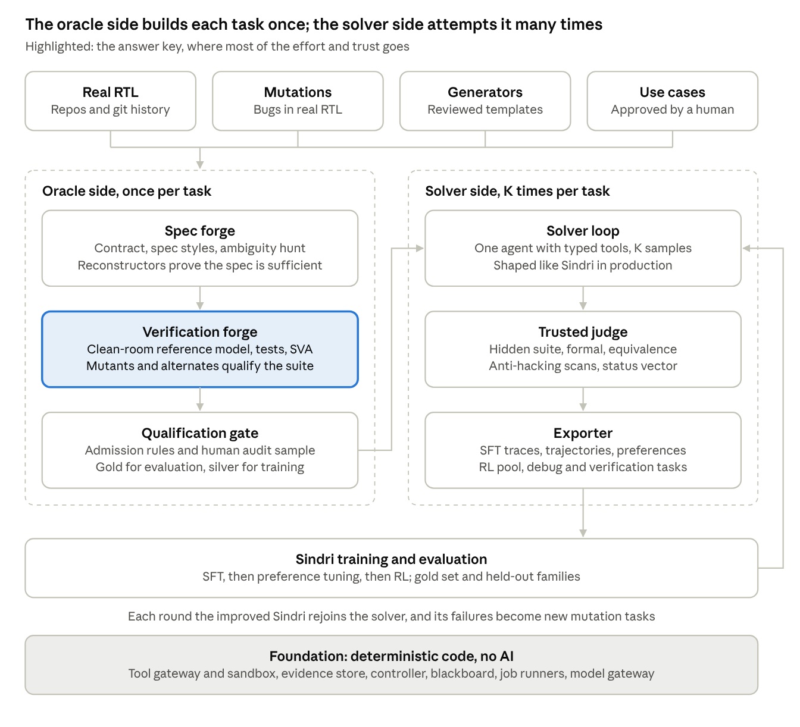
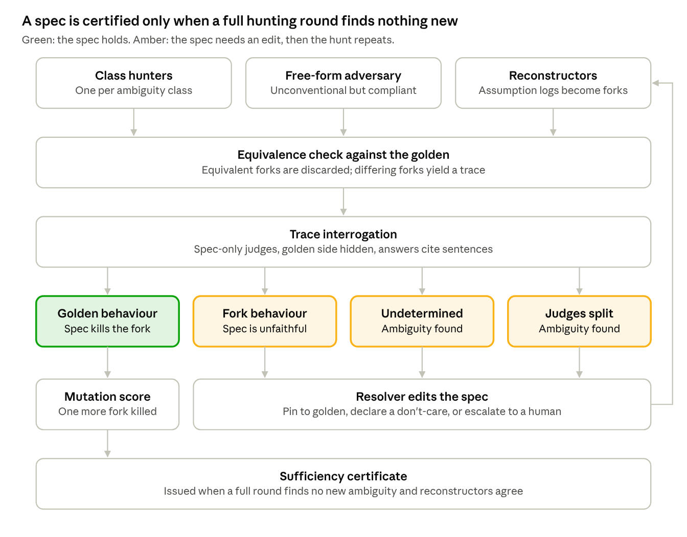
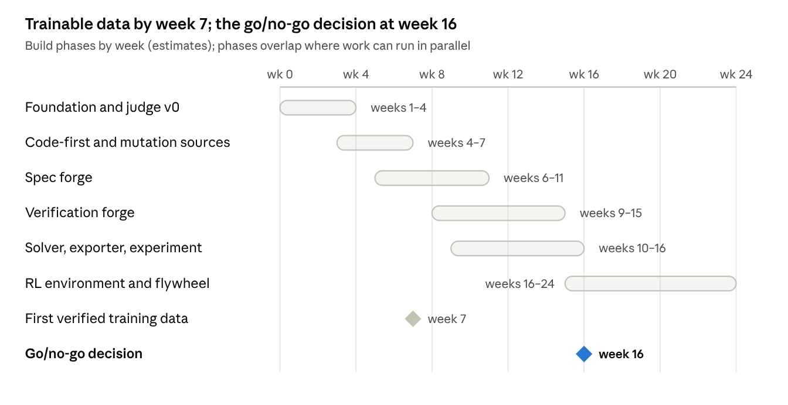

<!-- GENERATED by scripts/docx_to_md.py from docs/reference/Sindri_Master_Architecture_Verification_Data_Factory.docx. Do not hand-edit; regenerate from the source document. -->

# SINDRI
Verified Hardware Engineering & Data Factory

**Canonical Master Architecture, Agent System, Verification Strategy, Data Factory, Training Environment and Development Plan**

Audience: executives and stakeholders, AI/LLM engineers, RTL designers, DV/formal engineers, EDA/platform engineers, and implementation agents

Canonical architecture revision - October 2026

> Agents may propose. Tools may observe. Only independently controlled evidence may accept.

# Sindri Master Architecture: Verified Hardware Engineering & Data Factory

Oct 2026 · Canonical merged architecture

## 1. Executive summary

We will build a verified hardware engineering and data factory: a system that turns real RTL, repository history, reviewed generators and approved use cases into executable engineering tasks; builds and qualifies independent answer keys; lets deployment-shaped Sindri agents solve those tasks with controlled tools; and converts the complete engineering episodes into evaluation, SFT, preference and RL assets. The durable advantage is the factory and its library of qualified environments, not any single base model.

### Canonical decisions in this revision

- The specialist swarm lives primarily on the oracle side, where tasks and answer keys are manufactured once and can be slow and expensive. The normal solver path is one deployment-shaped Sindri agent with tools. Multi-agent solving remains an ablation and escalation mode, not the default.
- Golden RTL is evidence, not universal authority. A reconstruction task may intentionally target reference behaviour; an engineering-intent task is governed by the approved contract. If product intent, documentation and golden behaviour disagree, the task is quarantined until resolved.
- The first product-quality milestone is a trustworthy evaluator and reproducible evidence system, not a benchmark increase.
- The verification environment is itself a product that must be qualified with known-correct alternatives, realistic mutants, formal-assumption audits and anti-grading attacks before it may label training data.
- The final go/no-go experiment tests transfer to a structurally different held-out family under matched budgets; serious RL work begins only after evaluator and data quality are stable.

### Why we need it

- **Scraped HDL data made Sindri worse, not better.** Continued pretraining and fine-tuning on public corpora (VerilogDB, DeepCircuitX, OpenRTL) lowered VerilogEval scores. The data is unverified, noisy, and in the wrong format for a reasoning model.
- **Public benchmarks do not measure our product.** VerilogEval is saturated by frontier models with good tooling and covers small, isolated problems. Clients need work done inside real codebases: modify, debug, verify, complete.
- **Both training and evaluation need the same scarce thing:** hardware tasks with a trustworthy answer key. Nobody sells this. We have to manufacture it.

### What the factory produces

| Output | What it is | Who uses it |
|---|---|---|
| Gold evaluation set | ~300 human-signed tasks shaped like client work, never used for training | Model team, leadership, sales |
| Verified training data | Reasoning traces and agent trajectories whose correctness was checked by tools | Sindri fine-tuning (SFT) |
| Preference pairs | Correct vs incorrect attempts on the same task | Preference tuning |
| RL environments | Tasks plus automated reward that Sindri can practise on | Reinforcement learning |
| Verification tasks | Testbench, assertion and debug tasks with measurable rewards | Training Sindri's weakest skills |

### The one idea that makes it work

No AI-generated artifact may certify another AI-generated artifact by agreement. If one model writes the design, the tests and the answer key, they can all agree and all be wrong. Every acceptance must end in independent evidence: formal equivalence against real hardware, tests that are proven to catch injected bugs, or a human decision.

### What it will and will not do

- **Will:** produce verified block-level digital RTL tasks and solutions (single clock, synchronous logic) at a volume no human team can match, with measured error rates.
- **Will not (v1):** certify silicon, handle multi-clock or clock-domain-crossing logic, analog, timing closure, or production signoff. Those need commercial flows and human experts.

### The decision that justifies the investment

After about four months (week 16) we run one experiment. We compare five setups at equal compute: base model, base model plus harness, harness plus playbook, fine-tuned on factory data, and RL-trained on factory environments. We test on a family of hardware problems that none of the training data came from. If the fine-tuned or RL-trained Sindri beats base-plus-harness on that unseen family, the factory manufactures signal that transfers, and we scale it. If not, we have spent weeks, not quarters, finding out.

### Cost, team and timeline

| Item | Plan |
|---|---|
| Timeline | First trainable verified data around week 7; go/no-go decision around week 16; full factory in 5–6 months (estimate) |
| Team | 1 LLM/platform engineer (lead), 1 RTL design engineer, 1 verification/formal engineer, 1 infrastructure engineer (part-time early), AI coding agents for implementation |
| Compute | 64–128 CPU cores for simulation and formal tools; GPU serving for teacher models (the dominant cost); existing training clusters |
| Main risk | The answer keys are wrong in ways we cannot see. Mitigation: mutation-qualified tests, formal equivalence, and a measured false-accept rate from human audits |

### What we ask of leadership

1. Fund a dedicated verification/formal engineer. Without one, the gold evaluation set and the audits that measure data quality cannot exist.
2. Accept that the first milestone is a trustworthy evaluator, not a higher benchmark score.
3. Judge the program at the transfer experiment, using the go/no-go rule above.

### 1.1 Source basis and scope of this master revision

This document merges the detailed 'Sindri Hardware Data Factory: Architecture, Components and Build Plan' with the 'Sindri Verified Hardware Engineering Factory Architecture' and the earlier Chipforge harness architecture/research notes. Where they disagreed, this master revision makes the decision explicit instead of preserving both designs as if they were equivalent.

> The source documents support the architecture, component responsibilities, verification philosophy, data model, training flow and staged implementation plan. Where this revision adds implementation detail - especially engineer-grade testbench structure, authority modes, failure triage, release semantics and workstream planning - those additions are design synthesis intended to make the system buildable; they are not claims of measured performance.

## 2. How to read this document

This document serves four readers; each has a short path through it. Every component is described in the same card format, so an engineer or an AI coding agent can build from it directly.

### Reading paths

| Reader | Read first | Then |
|---|---|---|
| Executives and stakeholders | 1 Executive summary, 3 The problem, 4 Principles | 7 Overview, 17 Evaluation, 23 Build plan, 24 Risks, 25 Scope |
| AI / ML engineers new to hardware | 5 Hardware primer | 7 Overview, then 8–16 component chapters, 19 Walkthrough |
| HDL / verification engineers new to AI agents | 6 AI primer | 10 Spec forge, 11 Verification forge, 12 Gate, 14 Judge, 18 Multi-agent design |
| AI coding agents and implementers | 4 Principles, 20 Schemas, 21 Repository layout | Every component card in 8–16, then 22 Metrics and 23 Build plan |

### The component card

Every component in chapters 8–16 is described with the same fields:

- **Plain-English summary:** what it does, in one or two sentences anyone can follow.
- **Kind:** *Deterministic* (ordinary code, no AI), *Agent* (an AI model doing a narrow job), or *Hybrid* (code that calls an agent at defined points).
- **Inputs and outputs:** the exact records it reads and writes (schemas in chapter 20).
- **Inside:** its sub-components.
- **How it works:** the algorithm, step by step.
- **What it must never do:** the boundaries that keep the system honest.
- **Failure modes and guards:** what goes wrong and what catches it.
- **Build notes:** tools, effort estimate, and order.

### Conventions

- **"Estimate"** marks any number we have not measured ourselves yet: costs, timelines, thresholds. Treat these as starting points to be replaced by measurements.
- **"Golden"** means the reference design we trust for a task (real RTL, a human-approved design, or a correct-by-construction generator output).
- **"Candidate"** means any design produced by an agent and not yet accepted.
- **Sindri** is our student model (Nemotron-3 Nano 30B-A3B base). **Teacher** means a stronger model used to generate solutions and data (for example Nemotron-3 Super 120B, or a frontier API model where terms allow).
- Hardware terms are defined in chapter 5 and AI terms in chapter 6; both are also in the glossary (chapter 26).

## 3. The problem

Our bottleneck is not model size or training compute. It is the absence of hardware tasks with a trustworthy answer key, and both training and evaluation depend on that.

### 3.1 What happened when we trained on public HDL data

We ran continued pretraining (CPT) and supervised fine-tuning (SFT) on VerilogDB, DeepCircuitX and OpenRTL. Training curves looked healthy, but VerilogEval pass@1 went down. Our first CPT run (v0.1) improved token-level accuracy while VerilogEval dropped about 14 points.

Part of that was plumbing, and we have fixed those issues:

- evaluation data leaking into training;
- missing end-of-sequence tokens in packed documents;
- LoRA silently skipping the mixture-of-experts layers;
- an evaluator that treated warnings as compile errors.

Three structural causes remain even after those fixes:

1. **We were overwriting a better prior with a worse one.** Nemotron-3 Nano was already post-trained on RTL data and then trained with reinforcement learning on verifiable rewards, per NVIDIA's published Nano 3 recipe. Feeding it unverified scraped code replaces careful training with noise.
2. **Unverified data actively hurts.** A September 2026 study found that training Qwen2.5-Coder-7B on the full RTLCoder-27k set scored 37.20% average pass@1, against 44.08% for a curated 20–25% subset ([source](https://arxiv.org/abs/2609.22765)). More data of unknown correctness is worse than less data of known correctness.
3. **The format was wrong.** Nano is a reasoning model: it thinks before answering. Training it on plain description→code pairs teaches it to stop thinking. The successful published RTL models (CodeV-R1, ScaleRTL) train on reasoning traces.

**Conclusion:** we need fewer, verified, correctly formatted, harder examples, not more scraped tokens.

### 3.2 Why VerilogEval is not the goal

VerilogEval is a useful regression alarm, but a poor target.

- **It is saturated.** A validation-first agent harness with Claude 4.6 models reached 96.15–98.72% on VerilogEval-Human across seven runs ([source](https://arxiv.org/pdf/2604.19856)). There is little left to measure at the top.
- **It tests small, isolated modules.** Client work happens inside existing codebases: completing a module, changing a feature, fixing a bug, writing checkers.
- **Harder, more realistic tasks are far from solved.** In NVIDIA's HORIZON agent study, CVDP checker generation started at 3.8% and code completion at 3.2% on the first iteration ([source](https://arxiv.org/pdf/2606.28279)).

We keep VerilogEval as one row in a larger evaluation ladder (chapter 17). We stop optimising for it.

### 3.3 The oracle problem, in plain words

An **oracle** is whatever decides whether an answer is correct: a testbench, a reference model, an equivalence check, a human.

Imagine a student who writes the exam, writes the answer key, takes the exam, and grades it. They will score 100%, and that score tells you nothing about whether they understood the subject. That is what happens when one AI writes the specification, the design, the testbench and the judge, then loops until everything agrees.

A concrete hardware example: a FIFO spec says a full FIFO may accept a write in the same cycle as a read. The AI misreads it as "refuse writes when full." It then writes RTL that refuses, a Python model that refuses, a testbench that expects refusal, and an assertion that checks refusal. Simulation, formal checks and coverage all pass, and the design is wrong.

The numbers confirm that AI-written testbenches are not reliable answer keys on their own. On 156 HDLBits problems with GPT-4o-era models, testbenches generated from the spec alone were correct about 33% of the time when generated directly. Even the best self-correcting methods reached only 70–72% (AutoBench 52.18%, CorrectBench 70.13%, ConfiBench 72.22%). Newer models do better, but the remaining errors cluster in exactly the hard parts: timing, protocols and boundary conditions.

NVIDIA's HORIZON study shows the same trap from the other side. Its agent loop drove every benchmark suite to 100% completion, and its authors warn that a pass can mean the design satisfied the visible test harness rather than the specification ([source](https://arxiv.org/pdf/2606.28279)). Looping until tests go green converges on agreement with the tests, whatever the tests say.

### 3.4 So the real problem is

How do we manufacture, at scale, hardware tasks whose answer keys we can trust, and know how much we can trust them? Everything in this document is an answer to that question.

## 4. Core principles and non-negotiables

These ten rules decide every design trade-off in this document; when a shortcut conflicts with one, the rule wins. They go at the top of the repository README.

1. **Agents propose, tools observe, the evaluator accepts.** An AI agent can write designs, tests, specs and claims. Only deterministic tools produce observations, such as a simulation result or a formal proof. Only the trusted evaluator, under a versioned policy, decides acceptance.
2. **No self-certification by agreement.** Five models agreeing is not five pieces of evidence. They often share the same misreading. Every acceptance must end in independent evidence: formal equivalence against a trusted design, a test suite proven to catch injected bugs, or a human decision.
3. **Disagreement becomes an experiment, never a vote.** When two agents disagree, the system turns the disagreement into something executable: a counterexample trace, a distinguishing test, an assertion, or a mutant. If agents disagree about what the specification means, the requirement is marked ambiguous and resolved by a source of truth. It is never resolved by majority.
4. **Independence comes from information hiding and diversity, not personas.** The agent writing the reference model never sees the RTL. The agent writing the RTL never sees the hidden tests. Judges see a trace with the two sides labelled A and B, not which side is the original. Where possible, different roles use different model families.
5. **The swarm lives on the oracle side; the solver looks like deployed Sindri.** Building a task and its answer key happens once per task, so it can be slow, careful and use many specialist agents. Solving a task happens many times, and its recordings become Sindri's training data. So the solver must look like what Sindri will actually do in production: one agent loop with tools.
6. **Measure label precision; never assume it.** "Verified" is a number, not a feeling. A hardware engineer audits a random sample of accepted data every batch. The measured false-accept rate is published with every dataset.
7. **Correctness first, everything else after.** Rewards and acceptance are gated. A design that fails a mandatory correctness check gets nothing, however small or fast it is. Quality signals (area, timing, efficiency) only count after correctness passes.
8. **Split by lineage, before generating.** Every task belongs to a family and a lineage. Train, development and final-evaluation splits are assigned at the family level before any variants are generated, so that variants of one design never appear on both sides.
9. **Every result belongs to an exact artifact.** Results are tied to content hashes of the design, tool versions and configuration. A pass on yesterday's file means nothing for today's file. Evaluators are versioned, and tested like production code.
10. **Build the smallest system that tests the thesis.** One monorepo, a handful of modules, a database and an object store. No microservices, no Kubernetes, no distributed queues until job volume demands them.

> Authority rule - Golden is evidence, not universal authority. Every task declares an authority mode: reference-behaviour, approved-engineering-intent, or generated-correct-by-construction. Conflicts between declared intent and reference RTL are quarantined, not silently normalized.

```
authority_mode:
  reference_behavior       # reproduce an existing circuit exactly under the declared relation
  engineering_intent       # approved contract outranks a buggy/quirky implementation
  correct_by_construction  # human-reviewed generator/reference defines the intended family
```

### The one-line version

> The winner is not the agent that argues best; it is the design for which the system can produce the strongest reproducible evidence.

## 5. Hardware primer for AI engineers

RTL code looks like software but describes a circuit in which everything runs in parallel and time moves in clock ticks. Most bugs, and most of this document's machinery, come from that difference.

### 5.1 The basic objects

- **RTL (register-transfer level):** a description of a digital circuit as registers (memory that updates on a clock edge) and the logic between them. Written in Verilog or SystemVerilog (SV).
- **Module:** the unit of design, like a class with fixed inputs and outputs. Modules instantiate other modules, which forms a hierarchy.
- **Ports:** the module's inputs and outputs, each with a bit width (for example 8 bits) and sometimes signedness.
- **Parameters:** compile-time constants such as DEPTH or WIDTH. One RTL file can describe many circuit sizes.
- **Clock:** a signal that ticks. On each rising edge, every register captures its next value at the same moment. The **cycle** is hardware's unit of time.
- **Combinational logic:** logic with no memory; outputs follow inputs within the same cycle. **Sequential logic:** registers; outputs change only at clock edges.
- **Latency:** how many cycles pass between an input and its effect on an output. A spec saying "the result appears two cycles later" is a hard requirement, not a style choice.

### 5.2 Things that trip up AI models

- **Reset.** A signal that puts the circuit into a known state. It is *synchronous* (takes effect at a clock edge) or *asynchronous* (immediately), and *active-high* or *active-low* (rst_n usually means active-low). Which registers reset, and to what values, is a frequent source of ambiguity.
- **Handshakes.** Blocks pass data with protocols such as *ready/valid*. The sender raises valid when data is available; the receiver raises ready when it can accept; data moves only when both are high in the same cycle. The edge cases are subtle and commonly specified:
  - Can valid drop before the data is accepted?
  - Must data stay stable while waiting?
  - May ready depend on valid?
- **Simultaneous events.** Two things in one cycle: a FIFO pushed and popped at once while full, or a counter cleared and incremented together. Hardware must define a priority, and specs often forget to.
- **Arithmetic detail.** Signed or unsigned, wrap or saturate on overflow, how to round, how to truncate widths. Software defaults do not apply.
- **Unknown values (X).** Real hardware powers up in unknown states. Simulators model this as X ("four-state" simulation: 0, 1, X, Z). Verilator, our main simulator, is mostly two-state; full four-state support is still early.

### 5.3 How hardware is checked

- **Lint:** static checks for suspicious code, such as width mismatches or unintended latches.
- **Simulation:** run the RTL on chosen inputs and watch the outputs cycle by cycle. Tools: Verilator (fast, compiles RTL to C++), Icarus Verilog (simpler, slower). A **waveform** is the recorded value of every signal over time; engineers debug by reading waveforms.
- **Testbench:** code that drives inputs into the design under test (DUT) and checks outputs. We write testbenches in Python with **cocotb**.
- **Reference model:** an independent, simple implementation of the intended behaviour, usually in Python. A **scoreboard** compares the DUT's outputs to the reference model's outputs.
- **Directed tests** target specific scenarios. **Constrained-random tests** generate many legal random input sequences to find what humans did not think of.
- **Assertions (SVA):** SystemVerilog Assertions state rules that must always hold, such as "the FIFO never outputs when empty." *Assumptions* constrain what inputs the environment may produce. *Covers* state scenarios that must be reachable.
- **Formal verification:** instead of trying inputs, a solver mathematically searches all possible input sequences for a violation. Tools: SymbiYosys (SBY).
  - **BMC (bounded model checking):** checks every input sequence up to N cycles. A pass means "no bug within N cycles."
  - **Prove** (k-induction or PDR): attempts a proof for all time. It does not always succeed on large designs.
  - **Cover:** proves a scenario is reachable. This guards against **vacuity**, where assumptions are so strict that nothing interesting can happen, so every assertion passes trivially.
- **Equivalence checking:** proves two designs behave identically at their ports for all inputs. We build a **miter**: both designs side by side, the same inputs fed to both, and an assertion that their outputs match. Tools: Yosys, EQY, SBY. This is our strongest oracle when we have a trusted design.
- **Synthesis:** converting RTL into logic gates. Yosys reports whether the RTL is synthesisable, its approximate area, and accidental latches.
- **Coverage:** *code coverage* measures which lines or branches tests exercised. *Functional coverage* measures which specified scenarios were hit. High coverage does not prove tests would catch bugs.
- **Mutation testing:** deliberately inject a bug (a **mutant**), such as flipping a comparison or delaying an output by one cycle. If the tests still pass, they are too weak. The **mutation score** (kill rate) is the share of real, behaviour-changing mutants the tests catch. Our main measure of test-suite quality.

### 5.4 Software concepts and their hardware equivalents

| Software idea | Hardware equivalent | Important difference |
|---|---|---|
| Function call | Module instance | Always running, every cycle, in parallel |
| Program execution | Simulation | Time is measured in clock cycles |
| Unit test | Directed test in a testbench | Must say when (which cycle) to check |
| Property-based testing | Constrained-random testing | Inputs must obey the protocol |
| Proof of correctness | Formal verification | Bounded results only hold up to N cycles |
| Two implementations, same behaviour | Equivalence checking | Must align reset, timing and don't-cares |
| Compiler | Synthesis | Some valid code (simulation-only constructs) cannot be built |
| Undefined behaviour | X values, unspecified outputs | Specs must declare what is a "don't-care" |

### 5.5 What is out of scope for v1, and why

- **Multiple clock domains and clock-domain crossing (CDC).** Needs specialised analysis that open tools do not provide well.
- **Timing closure, power and physical design.** Depend on technology libraries and long tool flows. They come after functional correctness.
- **Analog and mixed-signal.** A different discipline with different tools.

We start with synchronous, single-clock digital blocks. That covers a large share of block-level RTL work and is where open-source tools give trustworthy answers.

## 6. AI primer for hardware engineers

A modern AI model is a very well-read junior engineer. It is fast, tireless and often right, but confidently wrong in ways it cannot see. It learns exactly what its training data and rewards teach, including the mistakes. This chapter explains the moving parts in hardware terms.

### 6.1 Models and agents

- **Large language model (LLM):** a neural network trained to predict the next piece of text (a **token**, roughly a word fragment). It reads a prompt and writes a continuation. Its working memory is the **context window**, the amount of text it can see at once.
- **Reasoning model:** a model trained to "think", writing out intermediate reasoning before its final answer. Sindri's base model (Nemotron-3 Nano) is one. Training it on answers without reasoning teaches it to skip thinking, which is one reason our earlier fine-tuning hurt.
- **Sampling and temperature:** the model's output is random to a controlled degree. Higher temperature means more varied answers. We often draw **K samples** (say 8) for one task and keep the ones that verify. **pass@k** is the chance that at least one of k samples is correct.
- **Agent:** a model running in a loop with tools. It reads the task, decides an action ("run the simulation", "edit line 40"), receives the result, and decides again. Think of an engineer at a terminal, except every command goes through an interface we control.
- **Tool call:** a structured request from the agent, such as run_sim(candidate=c07, test=smoke). In this system, agents never get a raw shell. They get typed tools whose inputs and outputs we define.
- **Multi-agent system:** several agents with different roles (writer, critic, tester) coordinated by a controller. Useful when roles need different information or different blind spots. It does not help, and can hurt, when agents simply talk at each other (chapter 18).

### 6.2 How models are trained

- **Pretraining / continued pretraining (CPT):** reading huge amounts of raw text or code to absorb patterns. CPT on HDL makes a model more familiar with Verilog syntax, but not better at engineering.
- **Supervised fine-tuning (SFT):** showing the model input→output examples (task → reasoning → RTL) so it imitates them. It learns whatever the examples contain, including their errors. This is why every SFT example in our factory must be verified.
- **Distillation:** a stronger **teacher** model generates solutions, and a smaller **student** (Sindri) is trained on the teacher's verified outputs. The student can approach the teacher's skill at a fraction of its cost.
- **LoRA:** a cheap fine-tuning method that trains small add-on matrices instead of the whole model. It must be configured to cover the right layers. Our v0.1 run silently skipped the expert layers.
- **Preference learning (for example DPO):** showing the model pairs of a better and a worse answer to the same task, so it learns to prefer the better one. Our factory produces these naturally: a passing and a failing attempt on the same task.
- **Reinforcement learning with verifiable rewards (RLVR):** the model attempts tasks, an automatic checker scores each attempt, and the model is nudged towards higher-scoring behaviour (GRPO is the algorithm we expect to use). This needs a checker we trust, which is exactly what the factory builds.

### 6.3 How models fail

- **Reward hacking:** the model finds a way to score without doing the job. Hardware examples:
  - printing "PASS" from an initial block;
  - calling $finish before checks run;
  - writing different logic for simulation and synthesis using ifdef;
  - editing the testbench;
  - exploiting a timeout that the checker counts as a pass.
- Every one of these must be blocked by the judge (chapter 14).
- **Label noise:** if 10% of training examples are wrong, the model learns those errors as truth. A wrong testbench used as a reward teaches the model to match the wrong testbench.
- **Contamination:** if test problems, or near-copies, appear in training data, scores go up without real skill. Public benchmarks leak into public datasets more often than people think.
- **Overfitting to a family:** train on FIFOs of depth 7 and test on depth 8, and the score looks great while measuring almost nothing. Real generalisation must be tested on families never seen in training.
- **Common-mode error:** several models, or one model playing several roles, make the same mistake for the same reason. Agreement between them is not evidence.

### 6.4 What the AI side needs from hardware experts

- **Contracts and judgement on ambiguity:** what a spec should say, and which behaviours are legitimate freedoms ("don't-cares").
- **Bug catalogues:** the realistic mistakes that matter, so mutation testing targets real failure modes.
- **Audits:** a sample of accepted data reviewed by a human, so we can state a measured error rate.
- **Sanity on scope:** which designs, protocols and SystemVerilog features matter to clients.

The AI side gives back scale: thousands of verified tasks and trajectories built from each hour of expert effort.

### 6.5 How Sindri maps to a traditional RTL / DV flow

The factory does not invent a new hardware-development discipline. It automates and records the same sequence a strong design and verification team follows: clarify requirements, choose a microarchitecture, implement RTL, build an independent verification environment, debug failures, qualify correctness, synthesize, and release evidence. The difference is that each stage becomes an explicit artifact with machine-enforced authority boundaries.

| **Traditional engineering step** | **Human workflow** | **Sindri factory equivalent** | **Acceptance authority** |
|---|---|---|---|
| Requirements | Product/architect clarifies behaviour, interfaces and constraints. | Task Forge + Spec Forge + human resolution. | Approved contract / requirement registry. |
| Microarchitecture | Designer chooses state, buffering, datapath and timing. | Solver architecture planning; optional architecture specialists. | No automatic acceptance - proposal only. |
| RTL implementation | Designer writes synthesizable HDL. | Deployment-shaped Sindri solver edits candidate RTL. | Candidate remains untrusted. |
| Lint / compile | Designer runs parser, lint and elaboration. | Typed tool gateway and development checks. | Observation only. |
| Testbench / reference | DV engineer builds drivers, monitors, model, scoreboard and tests. | Verification Forge, clean-room from contract/spec. | Evaluator is untrusted until qualified. |
| Formal / assertions | DV/formal engineer proves invariants and corner cases. | Property agent + assumption auditor + SBY/equivalence harness. | Scoped proof evidence. |
| Coverage closure | DV closes planned scenarios and uncovered state. | Coverage closer plus mutation qualification. | Coverage alone never accepts. |
| Regression / sign-off | Team runs required suite and reviews residual risk. | Trusted Judge + Qualification Gate + Release Manifest. | Versioned policy and human sign-off where required. |
| Synthesis / implementation | Designer checks feasibility against target constraints. | Implementation/PPA extension when enabled. | Separate feasibility evidence after correctness. |

### 6.6 Cross-discipline mental model

For an AI engineer: RTL is not a sequential program. The main state changes on clock edges; many blocks operate in parallel; protocol legality, exact sampling cycles, reset semantics and bit widths are part of correctness. A model that writes syntactically valid Verilog can still be catastrophically wrong by one cycle or one bit.

For a hardware engineer: an agent is a model inside a controlled loop. It does not receive unlimited authority. It reads a task, chooses one typed action at a time, receives a structured tool observation, edits a new immutable candidate, and eventually submits. The deterministic controller - not the model - decides which actions are legal, what budget remains and when hidden evaluation runs.

## 7. System overview

The factory has two halves with opposite economics. The **oracle side** builds a task and its answer key, once per task, and can afford to be slow and thorough. The **solver side** attempts the task many times, and its recordings become training data, so it must look like deployed Sindri.



factory architecture · two halves on one foundation

Tasks are built once on the oracle side, cross to the solver side for many attempts, and every training round sends an improved Sindri back into the solver.

### 7.1 The six planes

Each plane has a different kind of authority. Keeping them separate is what makes the output trustworthy.

| Plane | What lives there | Authority |
|---|---|---|
| Task authority | Task forge, spec forge, contracts, requirement registry | Defines what the design is supposed to do |
| Engineering agents | Spec writers, hunters, reference-model writers, test writers, solvers, debuggers | May propose anything; certify nothing |
| Execution | Simulators, formal tools, equivalence, synthesis, lint, waveform tools | Produces observations; decides nothing |
| Trusted assurance | Verification forge qualifier, qualification gate, trusted judge | Decides whether evidence is sufficient |
| Data factory | Lineage, dedup, splits, evidence levels, exporter | Decides what may enter training or evaluation |
| Learning | SFT, preference tuning, RL, evaluation runner | Learns from qualified environments only |

### 7.2 The components at a glance

| Layer | Components | Runs |
|---|---|---|
| Foundation (ch. 8) | Tool gateway and sandbox, evidence store, controller, blackboard, job runners, model gateway | Always |
| Task forge (ch. 9) | Repo and git-history miner, mutation engine, generator families, use-case intake, dedup and lineage, difficulty profiler | Once per source item |
| Spec forge (ch. 10) | Fact extractor, contract compiler, spec writer, linter, ambiguity hunter, trace interrogators, resolver, reconstructors, leakage critic, certificate | Once per task |
| Verification forge (ch. 11) | Testplan, reference model, stimulus, scoreboard, properties, coverage, equivalence harness, suite qualifier, evaluator self-tests | Once per task |
| Qualification gate (ch. 12) | Admission rules, tiers, evidence levels, human audit | Once per task |
| Solver (ch. 13) | Deployment-shaped agent loop, microarchitecture explorer | K times per task |
| Trusted judge (ch. 14) | Hidden checks, status taxonomy, anti-hacking scans | Once per attempt |
| Exporter (ch. 15) | Dataset streams, record builder, novelty and yield accounting | Continuous |
| Training and evaluation (ch. 16–17) | SFT, preference, RL environment, evaluation ladder | Per training round |

### 7.3 The end-to-end flow

1. **Source.** A task starts from real RTL (an open-source repository or its git history), a mutation of real RTL, a parametric generator, or an approved use case.
2. **Specify.** The spec forge writes a precise contract and natural-language specs in several styles. Ambiguity hunters attack the spec until it pins down exactly one behaviour, apart from declared freedoms.
3. **Build the answer key.** The verification forge writes an independent reference model, tests and assertions. It then proves the suite works: it must pass the golden design, pass alternative correct designs, and catch injected bugs.
4. **Admit.** The qualification gate admits the task only if every check holds, and assigns a tier: gold (evaluation only), silver (training), or quarantine.
5. **Solve.** Solver agents attempt the task K times each across several models, using only development tests for feedback.
6. **Judge.** The trusted judge runs the hidden checks on each final attempt and returns a status vector.
7. **Export.** Successes, failures, repair trajectories and preference pairs become dataset records with evidence levels and lineage.
8. **Learn.** Sindri is fine-tuned and RL-trained on the exports, then evaluated on the locked gold set and on held-out families.
9. **Repeat.** The improved Sindri joins the solver pool. Its failures are mined into new repair tasks, and the loop runs again.

### 7.4 The flywheel

Each turn of the loop makes the next turn better:

- Sindri's mistakes become new mutants and debug tasks.
- Harder tasks enter the RL pool as Sindri's pass rate rises.
- New client use cases add new families.
- Every qualified task leaves behind a reusable environment.

Over time the asset that accumulates is a library of executable hardware engineering environments with verified trajectories. Competitors cannot download that.

### 7.5 Crosswalk to the original C01-C16 architecture

The earlier Chipforge harness plan named sixteen logical components. This master design keeps those authority boundaries while implementing them as a smaller monorepo. The crosswalk preserves continuity for people who have already reviewed C01-C16.

| **Original** | **Original role** | **Master implementation** |
|---|---|---|
| C01 | Intake and scope router | Task Forge T4 use-case intake + contract questions |
| C02 | Query rewriter and retrieval | Foundation context/retrieval service; activated for repo-scale tasks |
| C03 | Contract compiler and registry | Spec Forge S1 + Task Registry |
| C04 | Architecture planner | Solver microarchitecture explorer / optional architecture specialist mode |
| C05 | Context manager | Role-scoped context builder with access boundaries |
| C06 | Compactor and durable memory | Checkpoint + validated summary service for long episodes |
| C07 | Design and verification agents | Solver plus oracle-side specialist agents |
| C08 | Reviewer and critic | Blackboard findings + evidence-backed critics |
| C09 | Workflow controller | Foundation F3 deterministic controller |
| C10 | Tool gateway and workers | Foundation F1 + F5 |
| C11 | Trusted evaluator | Verification Forge + Qualification Gate + Trusted Judge |
| C12 | Failure triage and repair planner | Solver failure-triage subsystem in section 13.3 |
| C13 | Implementation and PPA service | Later-stage implementation/PPA extension; not a V1 dependency |
| C14 | Evidence and release service | Evidence Store + Judge replay + Release Manifest |
| C15 | Synthetic task and data factory | Task Forge + Exporter |
| C16 | Training and evaluation adapter | Training/RL integration + evaluation runner |

### 7.6 Canonical deployment topology

```
ORACLE SIDE - once per task, expensive and specialist-heavy
  Task Forge -> Spec Forge swarm -> Verification Forge swarm -> Qualification Gate

SOLVER SIDE - K times per task, shaped like product deployment
  one Sindri agent -> typed tools -> candidate edits -> development checks -> submit

TRUSTED SIDE
  hidden judge -> evidence/release -> dataset exporter -> training/evaluation
```

Three solver modes are maintained for experiments: Mode A, one Sindri agent plus tools (default); Mode B, one Sindri agent that may request bounded specialist escalation; Mode C, a full multi-agent solving team. B or C becomes product default only if it wins on acceptance, cost and reviewer effort at matched budgets.

## 8. Foundation layer

The foundation is ordinary, deterministic software with no AI in it. It runs tools honestly, stores every artifact immutably, and enforces who may do what. If it is wrong, every label above it is wrong, so it is built and tested first.

### F1. Tool gateway and sandbox

- **Plain-English summary:** the only way anything in the system touches an EDA tool. Agents ask for an action by name; the gateway runs the real tool in a locked container and returns a clean, structured result.
- **Kind:** Deterministic.
- **Inputs:** a typed tool request (tool name, candidate hash, profile, parameters).
- **Outputs:** an Observation record: a normalised status, a summary, parsed details (errors with file and line, failing assertion, counterexample trace), raw logs, and hashes of everything used.
- **Inside:**
  - *Tool adapters,* one per tool: Verilator 5.x, Icarus Verilog, Yosys with the slang SystemVerilog frontend, SymbiYosys (SBY), EQY, cocotb, coverage collection and a mutation runner.
  - *Result normaliser:* turns tool output into one status: PASS, FAIL, INCONCLUSIVE, TIMEOUT, TOOL_ERROR or UNSUPPORTED.
  - *Capability matrix:* a tested table of which SystemVerilog constructs each tool really supports.
  - *Container images:* pinned tool versions, recorded by digest.
  - *Resource limiter:* CPU, memory, wall-clock and output-size caps; no network.
- **How it works:**
  1. Validate the request against the tool's schema and the caller's permissions.
  2. Materialise the exact artifact versions by hash into a fresh workspace.
  3. Run the tool inside the container with limits.
  4. Parse the output, map it to a status, and write the Observation to the evidence store.
- **Typed tools exposed to agents:**

| Tool | What it does | Typical cost (estimate) |
|---|---|---|
| lint(candidate) | Verilator lint plus slang elaboration | Seconds |
| compile(candidate) | Build the simulation model | Seconds |
| run_sim(candidate, test_ids, seed) | Run development tests in cocotb | Seconds to minutes |
| inspect_waveform(run_id, signals, t0, t1) | Return a compact table of signal values over a cycle window | Seconds |
| run_formal(candidate, obligation_ids, mode, depth) | SBY bmc, prove or cover | Seconds to tens of minutes |
| check_equiv(a, b, contract_id) | Miter equivalence modulo declared don't-cares | Seconds to tens of minutes |
| synth(candidate) | Yosys synthesis and stats: cells, latches, black boxes | Seconds |
| coverage(run_id) | Line, toggle and functional-bin coverage | Seconds |
| submit(candidate) | Freeze a candidate for judging | Instant |

- **What it must never do:**
  - expose a raw shell;
  - let a candidate's files overwrite tests, assumptions or tool configuration;
  - treat a timeout or a crash as PASS;
  - reuse a result for a different hash.
- **Failure modes and guards:**

| Failure | Guard |
|---|---|
| A tool silently ignores an unsupported construct | The capability matrix and canary tests return UNSUPPORTED instead of a fake result |
| A warning gets misread as an error (our past bug) | The normaliser has golden-log regression tests |
| A test never actually ran | The adapter checks that expected test IDs appear in the results |

- **Build notes:** about 2–3 weeks (estimate). The slow part is the capability matrix and the parsers. Write the matrix as a test suite of tiny SV snippets per construct, run on every tool upgrade.

### F2. Evidence store and task registry

- **Plain-English summary:** the system's memory and its source of truth. Every file, result and decision is stored by content hash and never edited.
- **Kind:** Deterministic.
- **Inside:**
  - *Object store* for artifacts (RTL, tests, logs, waveforms), keyed by hash.
  - *Postgres* for metadata: tasks, candidates, observations, findings, dataset records.
  - *Append-only event log* of every action.
  - *Lineage service* assigning family, lineage, task and variant IDs.
- **How it works:** a result key is the hash of (artifact + tool image + configuration). Any change produces a new key, so stale results cannot be reused by accident. Tasks move through registry states: draft → specified → oracle-built → qualified (gold or silver) or quarantined → retired.
- **What it must never do:** overwrite or delete history. Corrections are new records that point to what they supersede.
- **Build notes:** about 1 week (estimate). SQLite is acceptable for the first pilot; move to Postgres before parallel runs.

### F3. Controller (deterministic orchestrator)

- **Plain-English summary:** the foreman. It decides what runs next, enforces budgets, and moves each task and episode through fixed states. Agents propose; the controller decides what is allowed.
- **Kind:** Deterministic.
- **Inside:** task state machine, episode state machine, budget manager, scheduler, invalidation rules, retry policy.
- **Episode states:** PREPARE → PLAN → IMPLEMENT → DEV_CHECK → TRIAGE ⇄ REPAIR → SUBMIT → JUDGE → RECORD.
- **Budgets per episode** (fixed per experiment so that models are compared fairly):
  - maximum tokens;
  - maximum tool calls;
  - maximum candidate versions;
  - maximum simulation jobs;
  - maximum formal seconds;
  - maximum repair attempts;
  - wall-clock time.
- **Invalidation rules:** any edit to a candidate invalidates every observation tied to the previous hash. Any edit to a test or contract sends the task back through qualification.
- **What it must never do:**
  - let a model decide that a task is "done";
  - extend a budget mid-episode;
  - route hidden-test results back to a solver.
- **Build notes:** about 1–2 weeks (estimate). A plain Python state machine with a job queue is enough. Add Ray only when one machine cannot keep up.

### F4. Blackboard

- **Plain-English summary:** a shared, structured noticeboard where agents post findings and claims, instead of chatting. The system's shared truth is these records, not a conversation transcript.
- **Kind:** Deterministic store, written by agents through a schema.
- **What gets posted:** Findings (claims with evidence and a proposed check), Forks, Interrogation answers, Resolutions and Requirement updates (schemas in chapter 20).
- **Rules:**
  - every finding names the requirement, artifact and evidence it concerns;
  - every finding has a status: hypothesis → check-proposed → confirmed or refuted by a tool;
  - only the controller changes status, and only from tool observations;
  - prose-only findings with no executable check are dropped after one triage pass.
- **Build notes:** a Postgres table plus validation code; about 3 days (estimate).

### F5. Job runners and result cache

- **Plain-English summary:** the worker pool that runs tool jobs in parallel and never repeats work it has already done.
- **Inside:** CPU worker pool (start with 64–128 cores), job queue with priorities (interactive solver jobs before bulk qualification), hash-keyed result cache, timeout watchdog.
- **Build notes:** about 1 week (estimate). The cache matters: qualification reruns the same golden design many times.

### F6. Model gateway

- **Plain-English summary:** one front door for every AI model call. It routes each request to the right model, records every prompt and response, and counts cost.
- **Inside:**
  - *router:* self-hosted teacher models on vLLM/SGLang, frontier APIs where licence terms allow, and Sindri checkpoints;
  - *logging:* prompt, response, model version, seed and temperature;
  - *cost meter:* tokens and GPU-seconds per task and per component;
  - *licence tags:* records which model produced each output, so data whose terms forbid training use is excluded.
- **What it must never do:** let an output with unknown provenance enter a dataset.
- **Build notes:** about 1 week (estimate).

### 8.7 Authority records and the common data model

The evidence store is not only blob storage. It is the system of record for what was required, what artifact was checked, what tools observed, what the model inferred, what policy accepted, and what may enter training. A natural-language summary is never authoritative by itself.

| **Record** | **Why it exists** |
|---|---|
| TaskManifest | Task/version, authority mode, family/lineage, source rights, split, approved contract hash, allowed edits and budgets. |
| Requirement | Original wording, normalized semantics, legal environment, assumptions, applicability and disposition. |
| EvaluationPolicy | Required check IDs, configurations, proof modes, tool profiles, parameter matrix, assumptions and approved exceptions. |
| CandidateManifest | Candidate/parent IDs, source hash, dependency hash, model configuration and patch ancestry. |
| EpisodeState | Controller state, branch, checkpoint, spent/reserved budget, pending jobs and restart pointer. |
| Observation | Authenticated tool output tied to immutable inputs; status, scope, diagnostics and raw evidence. |
| Finding | Requirement + candidate + observation references, hypothesis, uncertainty and proposed discriminating check. |
| SpecCertificate | Ambiguity attacks, reconstructor results, leakage findings and evidence tier for one spec style. |
| EvaluatorCertificate | Known-good/alternative controls, mutation results, assumption audit, anti-hacking tests and evaluator version. |
| ReleaseManifest | Accepted candidate, completed obligations, limitations, waivers, reviewer decision and replay recipe. |
| DatasetRecord | Lineage, provenance, outcome, assistance, rights, evidence level, false-accept estimate and objective eligibility. |

> Repository invariant: any claim containing 'passed', 'failed', 'proved', 'equivalent', 'accepted' or 'meets timing' must reference one or more Observation IDs with immutable inputs and declared scope.

### 8.8 Controller recovery, invalidation and safe parallelism

- Controller state is durable. A process crash must be recoverable from EpisodeState, event log, candidate manifests and pending job IDs without asking an LLM to reconstruct what happened.
- WAITING is an explicit state for long formal/synthesis jobs. No model tokens are burned while the system is waiting for external work.
- Early versions invalidate broadly. Any candidate edit invalidates candidate-specific observations; any evaluator/test/assumption change triggers evaluator requalification; any contract change sends the task back through specification and affected evaluator checks.
- Parallel jobs may share work only against immutable candidate IDs and complete cache keys. Architecture branches are separate candidates. Findings remain attached to the exact candidate that was inspected.
- Retry policy distinguishes infrastructure failure from candidate failure. A tool crash, expired license or worker eviction is not a negative RTL label.

### 8.9 Security, data boundaries and anti-tamper rules

- Generated code and tests execute as untrusted inputs in sandboxed workers with no network and restricted filesystem/process access.
- Solver-side files cannot modify hidden tests, evaluator assumptions, tool profiles, reward code or acceptance policy.
- Final reward/evaluation executes outside the policy-writable workspace.
- Customer, benchmark and final-evaluation boundaries apply not only to files but also to retrieval indexes, caches, summaries, agent memories and generated dataset exports.
- Every model output carries model/version/license/provenance tags; records whose usage rights do not permit training are filtered before export.
- Caches are content-addressed by all relevant inputs. A PASS from a previous candidate, tool image, parameter set or evaluator version is not reusable unless the complete key matches.

### 8.10 Context, retrieval and compaction for long repository tasks

The first pilot can operate with explicit files and bounded prompts. Repository-scale tasks eventually need the C02/C05/C06 functions, but they should remain simple and auditable. Retrieval produces a versioned EvidenceBundle; it never rewrites the contract. Role-specific context prevents hidden evaluator information from leaking to the solver.

- QueryPlan: original question, exact symbols, file paths, module hierarchy, tool/version terms, access scope and desired evidence type.
- EvidenceBundle: retrieved files/snippets with versions, provenance and relevance reason; no untracked copy/paste into long-term memory.
- Context Manager: creates a bounded projection for each role. The reference-model writer may see contract/spec but not candidate RTL; the solver may see development diagnostics but not hidden judge internals.
- Compaction: when context is too large, the system writes a derived summary plus explicit unresolved items and artifact references. The summary is validated against the durable records before a restart.
- Restart test: suspend an episode, reload from checkpoint, and verify that required constraints, best candidate, pending failures and remaining budget are preserved.

## 9. Task forge: where problems come from

The task forge produces raw task candidates from four sources, ranked by how trustworthy their ground truth is. Real RTL with formal equivalence is strongest; a bare use case is weakest. The forge also assigns lineage and difficulty to every candidate.

| Source | Ground truth | Realism | Volume | Primary use |
|---|---|---|---|---|
| T1 Real RTL and git history | The original circuit; formal equivalence | High | Thousands | Core SFT and RL, evaluation drafts |
| T2 Mutations of real RTL | The original is the fix, by construction | High | Very high | Debug and repair tasks, test-quality rewards |
| T3 Generator families | A human-reviewed generator plus a Python reference | Medium | Unlimited per family, low diversity | Coverage of basics, non-textual specs |
| T4 Use cases | Human-approved contract plus consensus | Highest relevance, weakest oracle | Hundreds | Long tail, gold evaluation, product demos |

### 9.1 Authority mode is assigned before task cutting

A real repository is a powerful source of realistic tasks, but the factory must declare what the task means. The same RTL can be used in different authority modes, and the distinction prevents us from accidentally teaching a bug as a product requirement.

| **Mode** | **Use** | **What counts as truth** | **What happens on disagreement** |
|---|---|---|---|
| Reference-behaviour | Reconstruct/complete an existing circuit. | The declared reference relation to the source RTL. | Quirk may remain if the task explicitly targets reproduction; document it. |
| Engineering-intent | Build what an approved requirement says. | Human-approved contract and cited intent. | Reference RTL is evidence; conflict is quarantined for resolution. |
| Correct-by-construction | Procedural family with reviewed generator/reference. | Reviewed generator + reference semantics. | Generator/reference bug invalidates descendants until fixed. |

### T1. Repo and git-history miner

- **Plain-English summary:** finds real, permissively licensed hardware designs and cuts them into tasks. It also turns real engineers' commits into realistic modification and bug-fix tasks.
- **Kind:** Hybrid (deterministic mining, with an agent for commit triage).
- **Inputs:** a curated list of repositories (for example OpenTitan, PULP-platform cores, CVA6, Ibex, Tiny Tapeout projects), each licence-checked before use.
- **Outputs:** task candidates of five types, each with a golden design:

| Task type | How it is cut | Golden |
|---|---|---|
| Spec-to-RTL | Remove a leaf module or a 2–3 level subtree; the rest of the repository stays as context | The removed RTL |
| Completion | Remove part of a module (a state machine, a datapath stage) | The removed lines |
| Modification | A feature commit: the "before" code plus a change request | The "after" RTL |
| Debug | A bug-fix commit: the "before" code plus a symptom | The fixed RTL |
| Comprehension | Questions about behaviour, answered from simulation | Simulated traces |

- **Inside:**
  - *crawler and licence filter* (allow-list of licences, per-file headers checked);
  - *elaborator:* slang/Yosys builds the module hierarchy and port lists;
  - *task cutter:* picks cut points with a clean interface and a reasonable size, initially 50–2,000 lines;
  - *commit triage agent:* reads diffs and messages, and classifies feature, fix, refactor or noise. Refactors are verified as behaviour-preserving by equivalence;
  - *build checker:* the cut task must compile and simulate with the golden in place.
- **How it works:** mine → elaborate → choose cut → confirm the golden builds → for commits, confirm by equivalence that "before" and "after" differ in behaviour → register the candidate with source, licence and lineage.
- **What it must never do:** ingest code whose licence forbids our use, or client code without explicit rights.
- **Failure modes:**
  - original RTL that has its own bugs: in reference-behaviour mode the source may intentionally remain the reproduction target, but the quirk is recorded; in engineering-intent mode a mismatch between RTL and approved intent quarantines the task until a human resolves the authority conflict.
  - commit messages that make poor specs: the spec forge rewrites them as proper change requests.
- **Build notes:** about 2–3 weeks (estimate). Git history is the most underrated source here: real changes, written by real engineers, with ground truth.

### T2. Mutation engine

- **Plain-English summary:** deliberately breaks a correct design in realistic ways. Each broken version becomes a debug task, a training negative, and a test of whether our test suites catch bugs.
- **Kind:** Hybrid.
- **Inside:**
  - *Operator library* working on the syntax tree: comparison swaps (< ↔ <=), off-by-one bounds, reset polarity flips, dropping a register from reset, removing a handshake term, width truncation, signed↔unsigned, saturate↔wrap, swapped state transitions, a one-cycle delay or advance on an output, a broken simultaneous push/pop.
  - *LLM bug proposer:* suggests realistic, design-specific bugs ("forgets to clear the packet counter on abort").
  - *Failure miner:* turns Sindri's real mistakes, from judged attempts, into new mutant patterns. Over time this is the most valuable input.
  - *Equivalent-mutant filter:* an equivalence check removes mutants that do not actually change behaviour.
  - *Severity classifier:* marks critical classes (data loss, duplication, protocol violation, wrong reset) that every suite must kill.
- **Evidence it works:** BugGen's agentic pipeline produced 500 bugs across five OpenTitan blocks with 94% functional accuracy, at about 17.7 validated bugs per hour. CraftRTL built targeted repair data by injecting errors collected from model checkpoints into open-source code.
- **What it must never do:** keep a mutant without confirming it changes behaviour, or label a mutant's severity without a rule.
- **Build notes:** about 1–2 weeks (estimate). Start with 15–20 operators and add classes from the failure miner.

### T3. Generator families

- **Plain-English summary:** parameterised templates that produce correct-by-construction designs plus a matching Python reference. A human reviews each generator once; after that, it produces unlimited correct tasks.
- **Kind:** Deterministic (human-authored generators).
- **Initial families:**
  - FIFOs (synchronous, with or without bypass, power-of-two and non-power-of-two depths);
  - arbiters (fixed priority, round-robin);
  - state machines from state tables;
  - control and status register (CSR) blocks from register maps;
  - CRC and LFSR;
  - fixed-point datapaths (multiply-accumulate, saturation);
  - APB and AXI-Lite slave interfaces;
  - ready/valid pipelines and skid buffers.
- **Non-textual spec renderers:** state diagrams, truth tables, Karnaugh maps and waveforms (WaveDrom JSON). CraftRTL found these were a specific weakness of fine-tuned models.
- **Limits:** low diversity. Cap generator output at roughly one fifth of the training corpus (estimate) so that real RTL dominates.
- **Build notes:** about 2–3 days per family, plus a review session with the RTL engineer.

### T4. Use-case intake and decomposer

- **Plain-English summary:** turns a client-style request ("a streaming accumulator, 16-bit signed, up to 256 samples, ready/valid, saturating, one sample per cycle") into precise block contracts that a human approves.
- **Kind:** Agent, with mandatory human approval.
- **Inside:**
  - *intake agent:* extracts requirements;
  - *question generator:* produces concrete questions about missing behaviour;
  - *block decomposer:* for multi-block requests, proposes blocks and interfaces;
  - *approval console:* a human signs each contract.
- **How it works:** request → requirement list → missing-behaviour questions → human answers → contract draft → spec forge (spec-first mode, section 10.6).
- **Primary use:** gold evaluation tasks, the product long tail, and demos. Not the bulk of training data, because its ground truth relies on human intent.

### T5. Dedup, contamination and lineage

- **Plain-English summary:** stops copies and near-copies from leaking between training and evaluation, and stops public benchmarks from leaking into training.
- **Kind:** Deterministic.
- **Inside:**
  - *text dedup:* MinHash over normalised source;
  - *structural dedup:* a hash of the Yosys-elaborated netlist, which catches renamed copies;
  - *benchmark decontamination:* checks against VerilogEval, RTLLM, CVDP, RTLLM-derived sets and our own gold set;
  - *lineage assignment:* family → lineage → task → variant IDs;
  - *split assignment:* train, dev or final evaluation, decided at family level before any variant is generated;
  - *novelty scorer:* measures how different a new task is from existing ones in behaviour, structure and failure modes.
- **What it must never do:** let a variant of a final-evaluation family enter training.
- **Build notes:** about 1–2 weeks (estimate).

### T6. Difficulty profiler

- **Plain-English summary:** measures how hard each task is for the current Sindri, by letting it try several times.
- **Kind:** Deterministic harness around the solver.
- **How it works:** run K attempts with the current Sindri checkpoint (for example K = 8) and record the pass rate. Tasks with a 10–80% pass rate are the most useful for RL. Tasks at 0% need teacher solutions or a curriculum. Tasks at 100% are retired from RL.
- **Build notes:** reuses the solver and judge; a few days (estimate).

## 10. Spec forge: turning a circuit into an unambiguous task

The spec forge writes the task statement and proves that it pins down exactly one behaviour, apart from declared freedoms. An ambiguous spec teaches Sindri to guess and punishes correct answers in evaluation. RTL-BenchMT found roughly 5–10% of tasks in public RTL benchmarks are ambiguous, and many tasks that every model fails are in fact flawed ([source](https://arxiv.org/pdf/2605.15537)).

### 10.1 What a good spec must be

- **Faithful:** everything it says is true of the golden design.
- **Sufficient:** every design that satisfies it behaves the same as the golden at its ports, under legal inputs, except where a difference is declared a don't-care.
- **Natural:** it reads like a real engineering spec. It describes behaviour, not the golden's internal structure, so the task cannot be solved by transcribing hidden code.

The mental model: a spec defines a *set* of possible circuits. Sufficiency means every member of that set is equivalent to the golden. We cannot list the set, so we sample it two ways. **Reconstructors** draw typical members by writing RTL from the spec alone. **Hunters** search adversarially for a legal member that behaves differently. Both give evidence, not proof, and the certificate records how much.

### 10.2 Stages

1. S0 Fact extractor reads the golden and records hard facts.
2. S1 Contract compiler turns facts plus meaning into a structured contract.
3. S2 Spec writer writes the natural-language spec in several styles.
4. S3 Spec linter checks the spec against the contract.
5. S4 Ambiguity hunter attacks the spec with forks.
6. S5 Trace interrogators judge each fork.
7. S6 Resolver edits the spec or the contract.
8. S7 Reconstructors rebuild the design from the spec.
9. S8 Leakage critic checks naturalness.
10. S9 Certificate packages the evidence.

Stages 5–8 repeat until a full round finds nothing new.



ambiguity hunt · fork, check, interrogate, resolve, repeat

Every fork either dies against the spec, exposes a spec error, or exposes an ambiguity that the resolver closes before the next round.

### S0. Fact extractor

- **Plain-English summary:** reads the golden design with tools and writes down facts no one has to guess.
- **Kind:** Deterministic.
- **Extracts:**
  - ports, widths, signedness and parameters (slang/Yosys elaboration);
  - clock and reset nets, and reset style;
  - finite state machines (Yosys fsm extraction);
  - inferred memories;
  - for each output, whether a combinational path exists from any input (registered or not).
- **Behavioural probing:** short random simulations measure reset values, latency histograms from input transaction to output, and behaviour during and right after reset.
- Output: a Fact Sheet. Every checkable field that claims to describe reference behaviour must agree with it. The Fact Sheet is authoritative evidence about what the reference RTL does; it is not automatically authoritative about what an engineering-intent task ought to require.

### S1. Contract compiler

- **Plain-English summary:** writes the task's machine-readable contract. It is the bridge between hardware meaning and automated checking.
- **Kind:** Hybrid. Deterministic fields come from the Fact Sheet; an agent fills semantic fields (purpose, protocol meaning); a validator cross-checks both.
- **Contract contents:**
  - module and parameter ranges;
  - clocks;
  - reset: name, polarity, style, outputs during reset;
  - interfaces and protocol rules;
  - timing: registered or not, latency;
  - declared don't-cares;
  - environment assumptions (what legal inputs look like);
  - the decision log (every ambiguity resolved, and how).
- **Example:** see chapter 20, Contract.
- **What it must never do:** state a fact that contradicts the Fact Sheet, or invent an environment assumption that is not in the source.

### S2. Spec writer

- **Plain-English summary:** writes the human-readable task in several styles from one contract.
- **Kind:** Agent (sees the golden and the contract).
- **Styles:**
  - terse ticket ("Need a packetizer that…");
  - formal datasheet with tables;
  - waveform-heavy (WaveDrom timing diagrams);
  - state table or diagram;
  - change request (for modification tasks);
  - bug report (for debug tasks).
- **Rules:** describe behaviour at the ports; give every requirement a hidden ID that maps to contract fields; use only port names, never internal signal names.
- **Output:** one spec per style, each certified separately.

### S3. Spec linter

- **Plain-English summary:** catches mechanical spec errors before expensive hunting starts.
- **Kind:** Hybrid.
- **Deterministic checks:**
  - every port is mentioned;
  - every number matches the contract;
  - polarity words agree with the contract ("active-low" next to rst_n, never "asserted high");
  - widths agree.
- **Agent check:** maps every contract field to the sentences that state it. An unmapped field is a gap; a sentence that maps to nothing is suspect.

### S4. Ambiguity hunter

- **Plain-English summary:** a team of narrow specialists, each an expert in one kind of underspecified hardware behaviour. Each tries to build a design that obeys the spec but behaves differently from the golden.
- **Kind:** Agents, one per ambiguity class, plus one free-form adversary.
- **The ambiguity taxonomy** (one specialist per row):

| Class | Typical open question | Fork operator applied to the golden |
|---|---|---|
| Reset | Sync or async? Which registers reset? Outputs during reset? Reset in mid-transaction? | Swap reset style; drop one register's reset; change an in-reset output |
| Timing | Registered or combinational output? Same cycle or next? Exact latency? | Add or remove an output register; shift latency by one |
| Handshake | May ready depend on valid? May valid drop unaccepted? Data stable while stalled? | Make ready depend on valid; allow valid retraction; change data under stall |
| Simultaneous events | Clear and increment together? Push and pop when full or empty? Bypass? | Flip priority; allow replacement when full; add an empty bypass |
| Memory | Read-during-write returns old or new data? | Swap read-during-write behaviour |
| Arithmetic | Signed? Wrap or saturate? Rounding? Truncation? | Signedness flip; saturate ↔ wrap; change rounding mode |
| Boundaries | Behaviour at maximum count, non-power-of-two wrap, DEPTH = 1? | Off-by-one at bounds; power-of-two wrap |
| Illegal inputs | Invalid opcode or address: defined behaviour or don't-care? | Change the response to illegal input |
| Bit order | MSB or LSB first? Byte order? | Reverse serialisation order |
| FSM defaults | Transitions on unlisted inputs? Recovery state? | Change the default transition |

- **Three fork generators, cheapest first:**
  1. *Class-targeted golden mutants:* a minimal patch to the golden changing only one decision. Checked for small diff size and that it compiles. This is mutation testing applied to the spec.
  2. *Free-form adversary:* sees only the spec and is told to pick the less conventional option wherever the spec is silent. Catches ambiguities outside the taxonomy.
  3. *Reconstructor assumption logs:* every reconstructor (S7) lists the assumptions it made, and each assumption becomes a fork candidate. This one costs nothing extra.
- **Equivalence filter:** each fork is checked against the golden, modulo declared don't-cares and environment assumptions (chapter 11, V7). An equivalent fork is discarded: it is a different way of building the same behaviour, not an ambiguity. A differing fork produces a counterexample trace.

### S5. Trace interrogators

- **Plain-English summary:** judges who answer one narrow question about one concrete trace: does the spec decide this output at this cycle, and which way?
- **Kind:** Agents (spec-only; they never see RTL).
- **Why a trace, not a design:** asking a model "does this RTL satisfy the spec?" is fuzzy, and judges conform to each other. Asking "at cycle 7, with these inputs, does the spec determine in_ready?" is concrete and checkable against cited sentences.
- **How it works:**
  1. Render the counterexample as a compact cycle table: inputs, then the two designs' outputs labelled **A** and **B** in random order, with the first divergence marked. Judges are never told which side is the golden, because otherwise they drift towards "the original".
  2. One judge answers: **A**, **B**, **UNDETERMINED** or **CONTRADICTORY**, citing sentence IDs.
  3. If the answer is UNDETERMINED or the citation is invalid, escalate to a panel of at least two model families.
- **Outcomes:**

| Outcome | Meaning | Action |
|---|---|---|
| Spec picks the golden's behaviour | The spec kills this fork | Counts towards the spec mutation score |
| Spec picks the fork's behaviour | The spec is unfaithful to the golden | Fix the spec (a writer bug) |
| Undetermined | A real ambiguity | Send to the resolver |
| Judges split | Ambiguity: if strong readers disagree, a model trained on it will be inconsistent | Send to the resolver |

- **Precedent:** TiCoder clarified intent with generated distinguishing tests in software. It raised pass@1 by an average of 45.97 absolute points within five user interactions ([source](https://www.microsoft.com/en-us/research/publication/llm-based-test-driven-interactive-code-generation-user-study-and-empirical-evaluation/)).

### S6. Resolver

- **Plain-English summary:** decides what to do with each confirmed ambiguity, under a fixed policy.
- **Kind:** Agent constrained by policy (sees the golden).
- **Policy:**
  - **Default for code-first tasks:** *pin* the decision to the golden's behaviour by adding or editing a spec sentence, and record it in the contract's decision log.
  - **Natural freedoms become don't-cares:** data while valid is low, reserved bits, timing of non-observable signals. Real specs leave these open. Over-pinning makes specs read like netlists.
  - **Pin budget:** if a medium block needs more than about 8 pins (estimate), the spec is becoming a transcription. Rewrite it at a higher level, or tag the task as a microarchitecture-level spec.
  - **Golden quirks:** if the pinned behaviour looks like a bug (a FIFO silently dropping a write when full), flag it. Either document it explicitly or drop the task. Never quietly encode bugs as requirements.
  - **Gold tier:** every resolution goes to a human.

### S7. Round-trip reconstructors

- **Plain-English summary:** three implementers from different model families each read only the spec and write the design. We check each one against the golden.
- **Kind:** Agents (spec-only).
- **How it works:**
  1. Reconstruct.
  2. Compile, feeding compile errors back to the reconstructor only.
  3. Check equivalence against the golden.
  4. If not equivalent, interrogate the counterexample (S5). Either the spec has a gap, or the reconstructor made a mistake.
- **Precedent:** SpecLoop reconstructs RTL from a candidate spec, checks it for formal equivalence against the original, and feeds counterexamples back to refine the spec. It separates compile validity from functional equivalence ([source](https://arxiv.org/abs/2603.02895)). We keep that separation so a reconstructor's syntax errors are never blamed on the spec.
- **Side benefit:** a reconstructor that turns out equivalent becomes an *alternative correct design*, used later to test that the test suite does not overfit (chapter 11, V8).

### S8. Leakage critic

- **Plain-English summary:** makes sure the spec does not give away the hidden answer.
- **Kind:** Hybrid (sees spec and RTL).
- **Checks:**
  - internal signal names appearing in the spec;
  - structural prescriptions ("use a 3-bit shift register") unless the contract marks the microarchitecture as constrained;
  - identifier overlap with the RTL above a threshold.
- **Output:** a leakage score. Above the threshold, the spec is rewritten.

### S9. Sufficiency certificate

Each certified spec carries:

- rounds run;
- forks tried per class;
- kill, pin and don't-care counts;
- the spec mutation score;
- reconstructor results by model family;
- judge agreement;
- the evidence tier (bounded to N cycles, proved, or simulation-only);
- leakage score and pin count;
- hashes of everything above.

### 10.3 When a spec is "sufficient" (proposed thresholds, to be calibrated)

1. A full hunting round finds no new ambiguity.
2. At least 95% of non-equivalent class mutants are killed by the spec; the rest are covered by declared don't-cares.
3. At least 2 of 3 reconstructors from different model families are equivalent to the golden.
4. Every reconstructor failure is triaged as an implementer error, with a cited sentence ruling out its divergent trace.

### 10.4 Testing the hunter itself

We test the hunter the way we test a testbench: plant defects and measure detection.

- Build a calibration set of about 100 human-audited sufficient specs.
- Derive planted variants by:
  - deleting a sentence;
  - blurring a number ("exactly 2 cycles" → "shortly after");
  - dropping a table row;
  - contradicting the golden.
- Measure **ambiguity recall** per class, and the **false-flag rate** on unmodified specs.
- Re-run the calibration whenever prompts or models change.

### 10.5 Failure modes and guards

| Failure | Symptom | Guard |
|---|---|---|
| Over-pinning | Spec reads like a netlist; tasks too easy | Pin budget, don't-care list, leakage critic |
| Leakage | Internal names or structure in the spec | Identifier-overlap check; structural-phrase critic |
| Vacuous equivalence | Everything passes | Assumptions come only from the contract; mandatory covers |
| Judge conformity | Missed ambiguities | Blinded A/B traces; cross-family panel; reconstructors as a backstop |
| Golden quirks | Bugs become requirements | Quirk flag; explicit spec or drop |
| Convention reliance | Reconstructors guess "rst_n means active-low" and hide a gap | Declare conventions in the contract; the free-form adversary deliberately breaks them |
| Style drift | Terse style insufficient, datasheet sufficient | Certify each style separately; keep insufficient ones as clarification tasks |
| Weak reconstructors | False ambiguity alarms | Strongest teachers as reconstructors; triage by citation |

### 10.6 Spec-first mode (from a use case, no golden)

1. A human drafts the contract with the intake agent (T4).
2. Reconstructors produce candidates, which are grouped into equivalence clusters.
3. Where clusters disagree, the distinguishing trace goes to the human as a concrete question: "at cycle 7, should in_ready be 0 or 1?" Humans are fast and accurate at judging concrete behaviours, and slow at auditing prose.
4. Each answer pins a decision. Repeat until one cluster remains.
5. That cluster's representative becomes the provisional golden. The independent reference model (chapter 11, V2) must agree with it before the task can be qualified.

### 10.7 Extra data the spec forge produces for free

- **Spec-to-RTL tasks** in several styles: the main product.
- **Ambiguity detection:** input is the pre-resolution spec; the target is the list of ambiguities, each with a distinguishing scenario. This trains Sindri to ask clarifying questions, which is valuable for clients with vague specs.
- **RTL-to-spec documentation:** reward is whether reconstruction from the generated spec comes out equivalent.
- **Trace questions:** spec-comprehension tasks.
- **Spec repair:** fix an unfaithful sentence, given a counterexample.

### 10.8 Cost and build order

- **Cost:** for a medium block, roughly 200–500K tokens per certified task, plus CPU-minutes of formal (estimate). Mostly single-judge interrogation, with escalation only when needed. Run hunters and writers on a self-hosted teacher; reserve a frontier model for one judge slot. The cost is spread over the dozens of downstream items each certified spec spawns.
- **Build order:**
  1. Week 1: fact extractor and equivalence runner.
  2. Week 2: contract schema, spec writer and linter.
  3. Week 3: round-trip reconstruction, which is useful on its own.
  4. Weeks 4–5: class hunters (reset, timing, handshake, simultaneous events, arithmetic first), trace renderer, interrogators, resolver.
  5. Week 6: calibration set, leakage critic, certificate.
- **Keep-or-cut metric:** "ambiguities found only by the hunter, not by round-trip." If it stays near zero, cut the hunter.

### 10.9 Resolving conflicts between intent, prose and RTL

Spec Forge maintains an explicit authority ledger. When documentation, human intent, extracted facts and reference RTL disagree, the system does not let the writer choose whichever source makes equivalence easier.

- Mechanical facts such as port width, parameter names and elaborated clock pins come from deterministic extraction unless the task explicitly transforms the interface.
- Behavioral intent comes from the approved contract for engineering-intent tasks.
- Reference-behaviour tasks intentionally target a declared equivalence relation to the source RTL.
- A suspicious golden quirk is raised as a finding. The resolver may document it, declare it outside the task, revise the reference, or drop the task. It may not silently turn a likely bug into a natural-language requirement.
- Every resolution gets a decision ID, source, approver and downstream invalidation set.

## 11. Verification forge: building and proving the answer key

The verification forge builds each task's test suite from the spec alone, then proves the suite works before anyone trusts it. This is the most important part of the system: a wrong answer key poisons every training example and every score built on it.

### 11.1 Why we need tests when we have equivalence

When a task has a golden design, formal equivalence against it is the strongest check. A real test suite is still needed for four reasons:

1. **Legal designs with different timing.** A same-cycle equivalence check rejects correct designs whose latency differs, where the contract allows it.
2. **No golden.** Spec-first tasks start from a use case and have no trusted design.
3. **Speed.** Simulation is far cheaper than formal during RL on larger designs.
4. **Skill.** Writing testbenches and checkers is itself a skill Sindri must learn, and it is the weakest category today. In HORIZON's runs, checker generation started at 3.8% ([source](https://arxiv.org/pdf/2606.28279)).

### 11.2 The clean-room rule

Every artifact in this forge is written from the **contract and spec only**. No agent here sees the golden RTL or any candidate. If the test writer saw the RTL, it would copy the RTL's interpretation, and the suite would agree with any bug the RTL contains.

### V1. Testplan agent

- **Plain-English summary:** turns every requirement into the scenarios that must be tested, and the coverage points that prove they were.
- **Kind:** Agent (spec-only).
- **Output:** a structured testplan. Each requirement ID maps to scenarios, and each scenario to functional coverage bins. Example: R03 "data stable while stalled" → scenarios "stall 1 cycle", "stall 8 cycles", "stall during reset release".
- **Check:** every contract requirement has at least one scenario; unmapped requirements block qualification.

### V2. Reference model agent

- **Plain-English summary:** writes an independent, bit-accurate, cycle-level Python model of the intended behaviour, from the spec alone.
- **Kind:** Agent (spec-only), deterministic validation.
- **Validation:** for code-first tasks, co-simulate the model against the golden on long random traffic. A disagreement means either a spec gap (back to the spec forge) or a model bug (regenerate the model).
- **Why Python:** a different language and a different abstraction (a deque instead of pointers and counters) makes it less likely to repeat the RTL's mistakes.
- **What it must never do:** see the RTL, or be "fixed" by copying RTL behaviour without a spec citation.

### V3. Stimulus agent

- **Plain-English summary:** writes the inputs that exercise the design.
- **Kind:** Agent (spec-only), producing cocotb code.
- **Writes:**
  - *directed tests* for every testplan scenario;
  - *constrained-random sequences* that obey the protocol (backpressure, legal opcodes, valid-holds-until-ready);
  - *protocol drivers* reused across tasks of the same interface type.
- **Seeds:** every random test logs its seed so failures replay exactly.

### V4. Scoreboard and monitors

- **Plain-English summary:** watch the design's outputs and compare them with the reference model at the moments the contract defines.
- **Kind:** Agent-written, then frozen in a library.
- **Rules:**
  - compare only at contract-defined sampling points;
  - allow latency variation only where the contract allows it;
  - mask declared don't-cares.
- **Known trap:** cocotb returns from a clock-edge trigger before downstream logic has settled. A monitor must sample in the settled (read-only) phase, or the testbench itself becomes the bug. Monitor templates are regression-tested against designs with known behaviour.

### V5. Property agent and assumption auditor

- **Plain-English summary:** writes SystemVerilog assertions for the rules that must always hold, then a separate auditor checks that the assumptions do not make them meaningless.
- **Kind:** Agents (spec-only).
- **Property agent:** writes assert (safety rules), assume (legal environment, only from the contract's environment rules) and cover (reachable scenarios) properties, run through SBY.
- **Assumption auditor:** a dedicated agent whose only job is to find assumptions that are too strong. Every assertion must have a reachable cover; an unreachable cover means the property may be vacuous. Assumptions supplied by a candidate design are always rejected.

### V6. Coverage closer

- **Plain-English summary:** finds what the tests have not exercised and adds stimulus until the testplan's coverage bins are hit.
- **Kind:** Hybrid. Verilator and functional-bin coverage are measured; an agent writes new stimulus for the gaps.
- **Important:** coverage measures what was exercised, not what would be caught. It is a requirement but never proof. A verification environment that runs and produces coverage has not shown it detects the bugs that matter. AgentDV, for example, optimises runnability, register-grounded checks and coverage-guided iteration ([source](https://arxiv.org/pdf/2608.27148)). Our acceptance bar is mutation-based (V8).

### V7. Equivalence harness

- **Plain-English summary:** builds a "miter" that runs two designs side by side on identical inputs and proves their outputs always match, except where the contract says they may differ.
- **Kind:** Deterministic generator, driven by the contract.
- **Sketch** (Yosys formal style):

```
module miter(input clk, rst_n, input [7:0] in_data, input in_valid, out_ready);
  wire g_ov, v_ov, g_ir, v_ir; wire [7:0] g_od, v_od;
  golden_top  G(.clk(clk),.rst_n(rst_n),.in_data(in_data),.in_valid(in_valid),
                .out_ready(out_ready),.out_valid(g_ov),.out_data(g_od),.in_ready(g_ir));
  variant_top V(.clk(clk),.rst_n(rst_n),.in_data(in_data),.in_valid(in_valid),
                .out_ready(out_ready),.out_valid(v_ov),.out_data(v_od),.in_ready(v_ir));
  reg init = 1;
  always @(posedge clk) begin
    if (init) assume(!rst_n);          // start in reset
    init <= 0;
    if (rst_n) begin
      assert(g_ov == v_ov && g_ir == v_ir);
      if (g_ov) assert(g_od == v_od);  // don't-care: data while !valid
      if ($past(rst_n && in_valid && !g_ir)) assume(in_valid && $stable(in_data)); // env rule
      cover(g_ov && out_ready);        // non-vacuity
    end
  end
endmodule
```

- **Details that decide whether it is correct:**
  - *Name collisions:* rename modules on import, because the golden and the variant usually share a name.
  - *Reset alignment:* start both in reset; compare under the contract's reset semantics; check in-reset outputs separately.
  - *Uninitialised state:* allow any initial value and rely on reset. Zero-initialising silently hides missing-reset bugs.
  - *Environment assumptions:* only from the contract's rules, never from either design. Each needs a reachable cover.
  - *Evidence tiers:* SBY bmc gives bounded evidence; set the depth above reset length plus maximum latency plus protocol sequence depth. prove (k-induction or PDR) gives an unbounded proof when it closes.
  - *Deep counters:* a 16-bit counter's wrap is unreachable by BMC. Check the smallest legal parameter set where the behaviour is still reachable (for example MAX_LEN = 4 instead of 64), plus induction, and label which parameter sets were checked.
  - *Variable latency:* where the contract allows it, cycle-exact miters reject legal designs. In v1, either restrict to cycle-exact contracts, or use transaction-level differential simulation as a weaker, labelled evidence tier.
  - *Structure:* EQY's partitioning works when the two designs are structurally similar. Reconstructions often are not, so fall back to the flat miter with SBY for block-sized designs.

### V8. Suite qualifier (the critic that matters)

- **Plain-English summary:** attacks the finished test suite to prove it is trustworthy. A suite that is not qualified cannot be used for training, rewards or evaluation.
- **Kind:** Deterministic, with an agent in the kill loop.
- **Three checks:**
  1. **Golden passes:** the suite passes on the golden design.
  2. **Alternatives pass:** the suite passes on other correct designs (equivalent reconstructors from S7, alternative microarchitectures from chapter 13). This proves the suite tests behaviour, not one implementation's internals.
  3. **Mutants die:** the suite fails on every critical-class mutant and almost all other non-equivalent mutants from the mutation engine (T2).
- **The kill loop:**
  1. Each surviving mutant goes to the stimulus agent as a target: "write a test that kills this".
  2. The new test is added, and all checks re-run (the new test must not fail the golden or the alternatives).
  3. Repeat until no survivors remain or the budget is spent.
- This is "agents fighting each other", grounded in execution.
- **Precedent:** GateTruth audited RTL benchmark testbenches this way. In its own 60-task suite, 46 testbenches cleared a 95% mutation-kill floor and 14 did not ([source](https://arxiv.org/pdf/2608.12635)).

### V9. Evaluator self-tests

- **Plain-English summary:** tests that the testing machinery itself cannot be fooled.
- **Kind:** Deterministic regression suite, run on every change to the harness.
- **Attacks it must catch:**
  - a test that never ran;
  - a run that exited early;
  - a printed fake "PASS" string;
  - the wrong candidate compiled;
  - a stale cached result;
  - a silently dropped assertion;
  - a changed formal assumption;
  - a timeout reported as a pass;
  - simulation-only conditional code;
  - writes to test files from the candidate's directory.

### V10. Development and hidden split

The finished suite splits in two:

- **Development tests:** visible to solver agents through run_sim, used for repair.
- **Hidden acceptance tests:** used only by the trusted judge.

Hidden tests are never returned to a solver, not even as failure messages during an evaluation run.

### 11.3 The quality bar: when a suite counts as "proper" (proposed)

| Criterion | Bar |
|---|---|
| Golden and all alternative correct designs | 0 false rejections |
| Critical-class non-equivalent mutants | 100% killed |
| Other non-equivalent mutants | At least 95% killed |
| Testplan functional coverage bins | At least 95% hit |
| Assertions | Every one backed by a reachable cover |
| Replay | Deterministic: same seed, same result |
| Audit | Included in the human audit sample |

Below this bar, "verified" is a feeling, not a fact.

### 11.4 What "engineer-grade testbench" means in this project

The goal is not to generate the largest testbench. The goal is the highest practical label precision under a declared scope. A strong verification environment combines independent representations, targeted corner cases, randomized exploration, assertions, formal reasoning, mutation sensitivity, false-rejection controls, deterministic replay and requirement traceability. No one technique is allowed to masquerade as complete correctness.

> The verification environment is accepted only after it has demonstrated both sensitivity and restraint: it must reject realistic wrong designs and accept materially different legal designs.

### 11.5 Testbench micro-architecture

```
CONTRACT / REQUIREMENTS
        |
        +--> Testplan + coverage model
        +--> Reference model (independent abstraction)
        +--> Assertions / formal obligations
        |
        v
  Stimulus / sequencer ----> Driver ----> DUT
                                |          |
                                |          +--> protocol/assertion monitors
                                |          +--> waveform / event trace
                                v
                         Input transaction log
                                           |
DUT outputs --> Output monitor --> normalized transactions
                                           |
Reference model ---------------------------+--> Scoreboard --> Finding / Observation
                                           |
                                Functional coverage
                                           |
                                  Mutation qualification
```

The components are intentionally separated. Drivers generate legal pin-level activity. Monitors only observe. The reference model predicts externally visible behavior. The scoreboard compares transactions at contract-defined sampling points. Assertions check invariants independently of the scoreboard. Coverage reports exercised scenarios. Mutation testing asks whether all of that machinery would actually notice realistic defects.

### 11.6 Requirement-to-testplan traceability

A DV engineer normally begins from a verification plan, not from random test generation. The factory does the same. Every Requirement ID produces one or more verification obligations and planned scenarios. The plan is stored before tests exist, so coverage cannot be retrofitted to whatever the agent happened to write.

| **Requirement class** | **Typical planned scenarios** | **Preferred evidence** |
|---|---|---|
| Reset | assert from idle; assert mid-transaction; deassert; repeated reset; outputs during reset | directed simulation + reset assertions + covers |
| Ready/valid | immediate accept; prolonged stall; ready toggles; valid holds; back-to-back transfers | driver legality + scoreboard + protocol SVA |
| Simultaneous events | push+pop; clear+increment; read+write same address; full/empty boundary | directed cases + formal properties |
| Arithmetic | min/max values; signed boundary; overflow; rounding/tie; truncation | reference model + boundary tests + formal where tractable |
| Memory | first/last entry; wrap; read-during-write; non-power-of-two depth | parameter matrix + random + formal invariants |
| FSM/control | every legal transition; illegal/default recovery; priority combinations | state coverage + assertions + mutation |
| Parameterization | WIDTH=1; DEPTH=1; odd/non-power-of-two; max supported configurations | compile/elaborate matrix + selected proof/sim matrix |
| Illegal input | invalid opcodes/addresses/protocol misuse as defined by contract | negative tests or declared dont-care/unsupported |

Traceability is bidirectional: Requirement -> Obligation -> Test/Property -> Observation, and every failing Observation can be mapped back to the earliest relevant requirement. Unmapped mandatory requirements block qualification.

### 11.7 Stimulus design: directed, constrained-random, stress and metamorphic

- Smoke tests prove the environment itself runs: reset, one transaction, one expected response.
- Directed tests target named semantic corners from the contract and the family fault catalogue. They are short, readable and become regression canaries.
- Constrained-random tests explore legal combinations the authors did not enumerate. The constraint layer comes only from the contract/environment policy, never from candidate behavior.
- Stress sequences intentionally hold backpressure, alternate extreme values, wrap counters, fill queues, drain queues, repeat simultaneous events and run long enough to reach deep state.
- Metamorphic tests check relations that should hold without requiring a separate golden value, for example inserting idle cycles should not change transaction order; two independent chunks concatenated should match concatenated results where the contract permits.
- Differential tests compare candidate behavior against a Python/reference implementation or multiple legal implementations at the transaction boundary.
- Every random run records seed, exact parameter configuration, generated transaction stream and tool image so any failure is exactly replayable.

### 11.8 Driver and monitor correctness

A broken driver can create illegal traffic; a broken monitor can sample the right signal at the wrong time. Both produce false labels. The driver/monitor library therefore behaves like infrastructure code and receives its own unit tests.

- Drivers implement protocol legality centrally (for example valid must remain asserted and data stable until ready when the contract requires it). Task tests request transactions; they do not reimplement handshake timing ad hoc.
- Clock/reset helpers make assertion/deassertion semantics explicit and support reset during traffic when allowed.
- Monitors sample only in a defined simulator phase. In cocotb, edge triggers can wake before downstream combinational logic settles; monitor templates wait for the appropriate read-only/settled phase before observing outputs.
- Transactions include cycle/time, signal snapshot, interface name, configuration and causal request ID so mismatches can be reduced to a minimal trace.
- Known-good canary DUTs validate driver/monitor timing on every tool upgrade.

### 11.9 Reference model and scoreboard design

The reference model should be simpler than the RTL and should encode intent at a different abstraction. A FIFO reference should use a queue/deque, not copy pointer arithmetic. A protocol block reference should operate on transactions/packets, not mirror the candidate state machine.

- Model state is explicit and serializable so a failure can replay from a checkpoint.
- The model consumes only legal input transactions and contract-defined environment events.
- The scoreboard compares only values the contract defines, at the times the contract defines. Dont-care data is masked instead of accidentally becoming a requirement.
- For variable-latency interfaces, the scoreboard matches transactions by ordering/ID and allowed latency window rather than cycle-exact output equality.
- For streams, scoreboards detect loss, duplication and reordering separately; a final aggregate mismatch is not enough for diagnosis.
- A reference-model mismatch with a trusted RTL is triage, not automatic proof the model is wrong. The shortest distinguishing trace returns to Spec Forge when semantics may be missing.

### 11.10 Assertion and formal plan

Assertions capture rules that should hold for every legal history, while simulation provides rich concrete traces. The two are complementary. Formal properties are organized by obligation type so proof scope is auditable.

| **Property type** | **Example** | **Common failure to avoid** |
|---|---|---|
| Safety | FIFO occupancy never exceeds DEPTH; no output transfer while empty | proving only an internal helper, not the external behavior |
| Protocol | valid/data remain stable while stalled | assumption accidentally forces ready high |
| Data integrity | accepted input eventually appears exactly once in order | occupancy-only proof that ignores contents |
| Reset | after declared reset sequence, state/output obligations hold | zero-initialization hiding missing reset logic |
| Liveness | accepted request eventually completes under stated fairness | unrealistic fairness assumption makes property vacuous |
| Reachability cover | full, empty, wrap, simultaneous event are reachable | treating cover as proof |
| Equivalence | candidate and reference relation match under contract | bad X/reset/dont-care treatment |

- Every assumption has a Requirement/EvaluationPolicy source. Candidate-generated assumptions are never trusted automatically.
- Covers demonstrate that important states and antecedents are reachable. An assertion that passes because its antecedent can never occur is not useful evidence.
- Formal observations record solver, mode, depth, initialization, clock abstraction, assumption set and parameter configuration.
- BMC PASS is labeled bounded to N cycles. prove/PDR/k-induction is labeled unbounded only if the tool closes the proof under the declared model.
- State explosion or timeout becomes INCONCLUSIVE/TIMEOUT, not FAIL or PASS. The triage planner may request decomposition, smaller legal parameters or a different approved proof strategy.

### 11.11 Coverage closure without fooling ourselves

Coverage is a map of what was exercised, not an oracle. The verification plan defines bins before execution. Coverage closer agents may propose tests for holes, but they cannot waive uncovered mandatory bins or claim correctness from a percentage alone.

- Structural/code coverage: useful for dead branches and stimulus reach, but can be high while checks are absent.
- Functional coverage: requirement-driven bins such as full->pop, empty->push, stall length buckets, reset during traffic and parameter combinations.
- Assertion coverage: antecedent hits and cover-property reachability, used to detect vacuity.
- Cross coverage is used sparingly for interactions that matter; uncontrolled crosses create millions of meaningless bins.
- Coverage closure stops when mandatory bins are hit or explicitly marked unreachable/unsupported with reviewed evidence. It does not chase 100% of every automatically generated metric.

### 11.12 Mutation qualification: proving the suite detects realistic bugs

Mutation is the central sensitivity test. Start from a known-good implementation, inject a specific plausible defect, confirm the mutant is executable and behavior-changing, then require the evaluator to reject it. Equivalent or invalid mutants are excluded from the kill denominator.

| **Fault family** | **Examples the suite should challenge** |
|---|---|
| Reset | polarity flip; one register not reset; wrong output value during reset; reset priority lost |
| Boundary | < vs <=; full/empty off-by-one; max/min saturation error |
| Wrap/indexing | power-of-two wrap used for DEPTH=3; DEPTH=1 zero-width index |
| Handshake | valid retracts early; ready illegal dependency; transfer counted without valid&&ready |
| Stall | data/state changes while transaction is stalled |
| Simultaneity | push/pop priority reversed; clear+increment mishandled; same-address memory collision wrong |
| Ordering/data integrity | drop, duplicate, reorder, stale data |
| Timing | one-cycle early/late; missing pipeline register; combinational path where registered required |
| Arithmetic | signedness flip; truncation; wrap vs saturate; rounding mode |
| FSM/control | default transition changed; illegal recovery removed; priority case swapped |

Critical classes are family-specific and mandatory. Report per-class kills, not only one global percentage. One surviving critical mutant overrides a flattering aggregate score and blocks automatic labels until investigated.

### 11.13 False-rejection controls and legal architectural diversity

A suite can be too strict. To detect this, maintain alternative correct implementations with different state encodings, pointer structures, pipeline organization or combinational/registered choices where the contract permits them. All must pass. A hidden test that rejects one legal architecture is an evaluator defect, not proof that the architecture is wrong.

### 11.14 Parameter and configuration verification matrix

Do not advertise arbitrary parameter support because one default configuration passed. The task declares a finite supported matrix for V1 and records exactly which configurations received which evidence tier.

| **Configuration class** | **Why it exists** | **Example for FIFO** |
|---|---|---|
| Smallest legal | exposes zero-width/index degeneracy | WIDTH=1, DEPTH=1 |
| Non-power-of-two | exposes implicit binary wrap assumptions | DEPTH=3 |
| Nominal | normal representative configuration | WIDTH=8, DEPTH=8 |
| Wider datapath | exposes casts/signedness/packing | WIDTH=32 |
| Boundary feature option | enables optional behavior or interface mode | bypass on/off if supported |

Formal may use the smallest legal parameter that makes a deep behavior reachable, while simulation covers larger configurations. The certificate states the exact parameter sets and never generalizes beyond them without a validated rule.

### 11.15 Verification-debug artifacts and minimal reproducers

- On the first mismatch, capture the shortest relevant transaction sequence and a compact cycle window, not a megabyte waveform dump as the only evidence.
- Persist raw waveform plus a normalized trace table of inputs, outputs, model predictions and the first divergent cycle.
- Map the mismatch to Requirement IDs and checker IDs.
- For formal, save the counterexample, property/assumption set and proof configuration.
- For mutation escapes, save mutant patch, equivalence classification and which checks unexpectedly passed.
- These artifacts feed the failure-triage subsystem and become high-value debugging training examples.

### 11.16 Practical sign-off bar for an evaluator

The exact thresholds are calibrated empirically, but the acceptance structure should be fixed. A task cannot be used for rewards merely because a few tests pass.

| **Gate** | **Minimum expectation before automatic labels** |
|---|---|
| Traceability | All mandatory requirements mapped to obligations/checks; no unresolved semantic finding. |
| Known-good | Golden/reference and all reviewed alternative-correct controls pass. |
| Critical mutations | 100% of reviewed applicable critical mutants killed, or task quarantined pending explicit resolution. |
| Other mutations | Target kill-rate is calibrated per family; every surviving reviewed mutant inspected. |
| Formal | Required property set completed with assumptions/covers audited; bounded/inconclusive scope preserved honestly. |
| Replay | Clean rebuild from stored hashes reproduces semantic results. |
| Anti-hacking | Fake PASS, skipped tests, stale candidate, hidden-test edits, timeout-as-pass and assumption tampering are rejected. |
| Human audit | Gold requires human sign-off; silver batches publish measured false-accept estimates. |

## 12. Qualification gate, tiers and evidence levels

A task enters the usable pool only through the qualification gate: a fixed, versioned rule set that checks the whole evidence package. Every admitted item carries a tier and an evidence level, so every consumer knows exactly how much to trust it.

### G1. Admission rules

- **Plain-English summary:** a checklist that must be fully green. There is no partial credit and no override by an agent.
- **Kind:** Deterministic.
- **Every task must pass all of these:**
  1. The golden passes the full suite (development and hidden).
  2. The reference model agrees with the golden (code-first) or with the consensus cluster (spec-first).
  3. The spec is certified sufficient (chapter 10.3).
  4. The suite meets the quality bar (chapter 11.3).
  5. At least one alternative correct design exists and passes.
  6. A clean replay from stored hashes reproduces every result.
  7. Lineage, licence and decontamination checks pass.
  8. No open findings remain on the blackboard for this task.

### G2. Tiers

| Tier | Meaning | Allowed uses | Who signs |
|---|---|---|---|
| Gold | Passed every rule, and a human reviewed the contract, resolutions and suite | Evaluation only; never training, prompt tuning or checkpoint selection | Verification engineer |
| Silver | Passed every rule automatically | Training (SFT, preference, RL) | The gate, plus sampled audit |
| Quarantine | Failed a rule, or flagged by an audit | Nothing until fixed or retired | Reviewed in triage |
| Retired | Superseded, saturated, or invalidated | Kept for history only | Controller |

### G3. Evidence levels on every record

Every dataset record, not just every task, carries the strongest evidence it has:

| Level | Name | What has been shown |
|---|---|---|
| Q0 | Generated | Only proposed; nothing checked |
| Q1 | Structural | Parses, elaborates and lints clean |
| Q2 | Behavioural | Passes a qualified simulation suite |
| Q3 | Formal-qualified | Required properties pass under audited assumptions, or bounded equivalence to N cycles |
| Q4 | Equivalence-proved | Unbounded equivalence to a trusted golden, or a full proof of required properties |
| Q5 | Engineering-accepted | Reviewed by a human as a release-quality package |

Consumers choose a minimum. For example: SFT positives require Q2 or above, and Q3 or above for premium subsets; RL rewards come only from qualified suites; gold evaluation requires Q3 or above plus human sign-off.

### G4. Human audit protocol

- **Plain-English summary:** the measurement that replaces "we think it is correct" with a number.
- **How it works:**
  1. Every batch, draw a random sample of silver tasks and accepted solutions: 100–150 items per family, as an estimate.
  2. The verification engineer reviews each item: is the spec faithful and sufficient, does the suite test the right thing, is the accepted solution actually correct?
  3. The share found wrong is the **false-accept rate**, published with a confidence interval alongside every dataset release.
  4. Every audit finding becomes a regression case for the component that missed it.
- **Targets (proposed):** false-accept rate at or below 3% for training data, and 0 known errors in gold.
- **Audit console:** a simple web view showing spec, contract, decision log, suite summary, mutant results, the candidate diff and a waveform viewer, with one-click verdicts.

### G5. What the gate must never do

- Admit a task because an agent says it is fine.
- Promote silver to gold without a human.
- Re-admit a quarantined task without re-running every rule on the new hashes.

### 12.1 EvaluatorCertificate: why we trust the answer key

Qualification emits a first-class EvaluatorCertificate rather than only a green badge. This is the evidence object that downstream training, evaluation and auditors can inspect.

```
evaluator_certificate:
  evaluator_version: fifo_eval_0017
  contract_hash: ...
  known_correct: {passed: 3, total: 3}
  alternative_correct: {passed: 2, total: 2}
  critical_mutants:
    reset: {killed: 8, applicable: 8}
    handshake: {killed: 11, applicable: 11}
    wrap: {killed: 9, applicable: 9}
  other_mutants: {killed: 94, applicable: 97, reviewed_survivors: 3}
  formal: {scope: [...], assumptions_audited: true, covers_reachable: true}
  anti_hacking: {fake_pass: blocked, stale_cache: blocked, early_finish: blocked}
  replay: reproducible
  reviewer: dv_owner
  decision: QUALIFIED
```

## 13. Solver: attempting tasks the way Sindri will in production

The solver is one agent loop with tools: read the task, plan, implement, check, debug, submit. It is the same shape Sindri will have in production. It runs many times per task, across several models, and every run is recorded as a potential training trajectory.

### 13.1 Why the solver is deliberately simple

Sindri learns from the solver's recordings. If the solver were a 20-agent conversation, Sindri would learn fragments of a process it never runs at inference. So:

- the heavy multi-agent machinery lives on the oracle side;
- the solver is a single agent whose phases are steps in one trajectory;
- diversity comes from sampling many runs across model families, not from many chatting roles.

### X1. Agent loop

- **Plain-English summary:** one agent, a fixed set of tools, a budget, and a sequence of phases.
- **Kind:** Agent, inside the deterministic controller.
- **Phases:**
  1. **Understand:** read the spec, contract (public part), repository context and the development tests' names. Write down assumptions explicitly.
  2. **Plan:** for multi-module work, write a short design note: blocks, interfaces, state, pipeline stages, latency budget.
  3. **Implement:** write or edit RTL.
  4. **Check:** lint, compile, then run_sim on development tests, and optionally run_formal on public properties.
  5. **Debug:** on failure, call inspect_waveform around the first divergence, form a hypothesis, make a minimal patch, and re-check. Each repair is one step in the trajectory.
  6. **Submit:** freeze the candidate. The controller ends the episode at budget exhaustion even without a submission.
- **What the agent sees:** spec, public contract fields, repository files, development tests, its own tool observations.
- **What it never sees:** hidden tests, the golden RTL, the reference model's code, mutants, the judge's internals.

### X2. Model pool and sampling

- **Plain-English summary:** decides which models attempt each task and how many times.
- **Pool:**
  - teacher models: self-hosted Nemotron-3 Super, and frontier APIs where licence terms allow training use;
  - current Sindri checkpoints;
  - the base model, as a control.
- **Sampling:** K attempts per model per task (for example 8), at a temperature high enough for variety. The MAGE study found that high-temperature sampling with ranking beat low-temperature generation on RTL ([source](https://arxiv.org/pdf/2412.07822)).
- **Why several models:** different families fail differently. Their correct solutions are diverse training data, and their failures are diverse repair data.

### X3. Debug toolkit

- **Plain-English summary:** the tools that let an agent debug like an engineer instead of guessing.
- **Inside:**
  - *waveform window:* returns a compact cycle table for chosen signals between two times, never a full waveform dump;
  - *first-divergence finder:* for development-test failures, the cycle where expected and actual outputs first differ;
  - *counterexample renderer:* formal counterexamples as the same compact table;
  - *diff tool:* the minimal patch between candidate versions.
- **Design rule:** observations must be short and structured. A model given 50,000 lines of log reads none of them well.

### X4. Microarchitecture explorer

- **Plain-English summary:** for larger designs, proposes two or three genuinely different internal structures (for example a register-array FIFO, a RAM-based FIFO, and a different occupancy encoding), then implements each.
- **Kind:** Agent, used in two places:
  - **Oracle side:** each correct alternative becomes an *alternative correct design* that the suite qualifier (V8) uses to prove the tests do not overfit one implementation.
  - **Solver side, for data:** recorded as planning steps ("I considered A and B; I chose B because…"), and the best-evidenced alternative is kept. Comparing alternatives yields preference pairs on design quality once correctness passes.
- **Rule:** alternatives are chosen by evidence (tests, formal, area and timing reports), never by an agent arguing for its own proposal.

### X5. Trajectory recorder

- **Plain-English summary:** writes down everything that happened, in the exact format Sindri will be trained on.
- **Kind:** Deterministic.
- **Records:** every model message, reasoning text (where the model exposes it), tool call and observation, candidate hash, budget consumption, and the final judge status.
- **Format:** the chat and tool-call template of Nemotron, so that recordings can be used for training without conversion errors.

### 13.2 Failure modes and guards

| Failure | Guard |
|---|---|
| Agent edits tests or harness files | Workspace permissions; the gateway refuses writes outside the candidate tree |
| Agent loops on the same fix | Repeat-patch detector; budget caps |
| Agent brute-forces the development tests | Hidden acceptance tests decide; development-test overfitting shows up as development pass with hidden fail, and is tracked |
| Agent rewrites everything instead of a minimal fix | Diff-size metric recorded; minimal repairs preferred in preference pairs |

### 13.3 Architecture exploration and specialist escalation

The default solver remains one Sindri agent. It may reason about microarchitecture itself and optionally call a bounded architecture-exploration tool that returns alternative plans. This avoids a permanent train/deploy mismatch while preserving specialist help for genuinely hard tasks.

| **Mode** | **Default use** | **What runs** | **Promotion rule** |
|---|---|---|---|
| A: single-agent | production-shaped baseline and normal training | one Sindri loop + typed tools | canonical default |
| B: specialist escalation | hard/ambiguous tasks after a trigger | Sindri + bounded critic/architect calls whose outputs become Findings | use only if matched-budget gains justify cost |
| C: multi-agent solver | research arm | parallel architect/critic/repair roles | promote only if robustly better on held-out repo tasks |

### 13.4 Failure triage and repair planner

A failed tool observation does not directly become an RTL edit. The triage subsystem separates facts from hypotheses, extracts the smallest useful reproducer, and chooses one discriminating action. This is the equivalent of a senior engineer narrowing a bug before changing code.

| **Input class** | **Deterministic first routing** | **Typical next action** |
|---|---|---|
| Parse/elaboration | syntax, missing include, unsupported construct | fix source/dependency or mark UNSUPPORTED |
| Simulation mismatch | first divergent transaction/cycle and requirement | inspect compact waveform; compare model/DUT; targeted test |
| Assertion failure | property + antecedent + counterexample | trace to contract; distinguish RTL bug vs property bug |
| Formal timeout | proof mode/depth/state size | decompose, smaller legal parameter, alternate approved proof strategy |
| Synthesis issue | latch/blackbox/unsupported/unconstrained | RTL/synthesis critic or task-support decision |
| Infrastructure error | worker/tool/license/cache failure | retry/censor; never label candidate incorrect |
| Ambiguous semantics | oracles/agents disagree with no authoritative answer | return task to Spec Forge / REVIEW_REQUIRED |

Triage emits: failure class, Observation IDs, minimal reproducer, first implicated Requirement IDs, ranked hypotheses with uncertainty, proposed discriminating check, affected evidence that a repair would invalidate, and a stagnation signature.

### 13.5 Repair discipline and oscillation control

- Repair the smallest evidence-supported region first. Large rewrites are separate branches, not silent replacements.
- Preserve the best-known candidate and its evidence while experimenting on a child branch.
- After a patch, rerun the checks invalidated by the dependency graph plus mandatory regression canaries; do not assume a local fix preserved unrelated behavior.
- Hash normalized failure signatures. If the same failure repeats across several repairs, switch hypothesis, roll back, escalate or stop.
- Record unsuccessful repairs. They are valuable training data only when the failure and outcome are correctly labeled.

## 14. Trusted judge

The judge is the only component that decides whether a submitted candidate is correct. It runs outside every agent's reach, with a frozen, versioned policy, and returns a status vector rather than a single score.

### J1. Checks it runs

- **Plain-English summary:** the full battery of hidden checks, in a fixed order, cheapest first.
- **Kind:** Deterministic.
- **Order:**
  1. *Integrity scan:* forbidden constructs and file tampering (J3).
  2. *Structure:* lint clean, elaborates, ports match the contract exactly.
  3. *Synthesis:* synthesisable in Yosys, with no unexpected latches and no black boxes.
  4. *Hidden simulation:* the full hidden acceptance suite (directed, random, scoreboard) across the contract's parameter sets and fixed seeds.
  5. *Formal:* required properties under audited assumptions.
  6. *Equivalence:* against the golden, where one exists and the contract is cycle-exact.
  7. *Quality (optional, only after all correctness checks pass):* area from Yosys stats, and later timing reports.
- **Short-circuit:** the first mandatory failure stops the run, except in data-collection mode, where all checks run so that failure labels are complete.

### J2. Status taxonomy

Every check returns one of these, and the judge returns the vector:

| Status | Meaning | Training use |
|---|---|---|
| PASS | Check ran and passed | Positive evidence |
| FAIL | Check ran and found a violation, with a counterexample | Negative label, repair data |
| INCONCLUSIVE | Formal did not finish within bounds | No label; never treated as a pass |
| TIMEOUT | Simulation or tool exceeded its budget | Negative only if the contract sets a performance bound; otherwise no label |
| TOOL_ERROR | Infrastructure failure | No label; retry; alert |
| UNSUPPORTED | Construct outside the tool capability matrix | No label; report |
| INVALID_SUBMISSION | Tampering or forbidden construct | Strong negative |
| INVALID_TASK | Golden or suite found faulty during judging | Task goes to quarantine; all labels from it are withdrawn |

**Final verdict:** ACCEPT only if every mandatory check is PASS. Any INCONCLUSIVE, TOOL_ERROR or UNSUPPORTED means no verdict, never acceptance.

### J3. Anti-reward-hacking scans

Blocked or flagged, each with a regression test in the evaluator self-test suite (V9):

- initial blocks or $display that print pass-like strings;
- $finish and $stop in the candidate;
- ifdef or ifndef on SYNTHESIS, VERILATOR, FORMAL or similar, which make simulated and built behaviour differ;
- file I/O ($fopen, $readmemh on paths outside the task);
- references to testbench hierarchy or hidden-test names;
- assumptions or assume statements inside the candidate;
- writes outside the candidate directory;
- suspicious delays (# delays) in synthesisable code;
- outputs hard-coded to match development-test vectors, detected when development tests pass and hidden tests fail on the same behaviours.

### J4. Sealed final evaluation

- During evaluation runs, the judge's results go only to the evaluation report, never back to the agent.
- During training, the reward service sees the training oracle. Agents see only development-test feedback.
- The final gold set's hidden tests never leave the judge, and are never used for checkpoint selection.

### J5. Versioning and regression

- The judge policy, test suites, tool images and assumption sets are versioned together. Every verdict names the exact version.
- Any change re-runs the evaluator self-tests and a regression set of known-good and known-bad candidates, with the expected verdicts locked.
- Old verdicts are never silently re-scored. A re-score is a new record.

### J6. What the judge must never do

- Accept on partial evidence.
- Change behaviour based on which model submitted.
- Leak hidden test content in error messages to solvers.

### 14.7 Evidence package, clean replay and release semantics

Acceptance and product release are related but not identical. The judge determines whether required obligations pass. The release service packages the candidate, evidence, limits and integration notes and performs a clean replay in the pinned environment.

- A release request freezes the candidate and runs the complete required acceptance inventory from scratch or from safely content-addressed immutable cache entries.
- The ReleaseManifest lists completed obligations, exact parameter/configuration scope, formal bounds/assumptions, tool versions, unresolved limitations, waivers and responsible reviewer.
- Waivers are narrow, justified, versioned and tied to integration context. A waiver does not silently become a dataset-positive label.
- Failed attempts remain in the evidence graph and may be exported as negatives/repairs, but they are never confused with the released candidate.
- Release self-tests intentionally attempt stale-candidate reuse, omitted parameter configurations, report copying and unauthenticated PASS injection. All must fail.

### 14.8 Later-stage implementation and PPA extension

V1 is function-first and does not claim physical sign-off. The architecture nevertheless preserves the earlier C13 interface so later work can measure synthesis and implementation feasibility without contaminating correctness.

- Input is a behaviorally accepted candidate, fixed target, fixed constraints and approved tool profile.
- Outputs include mapped netlist, latch/black-box checks, timing/area metrics and optional routed physical metrics.
- Transformation equivalence or an approved check links implementation back to accepted RTL.
- Agents may explore approved architecture/flow parameters but may not relax clocks, invent false paths, change libraries or alter workload assumptions to game the score.
- A functionally correct candidate that misses a mandatory physical target is CORRECT_INFEASIBLE, not FUNCTIONAL_FAIL.

## 15. Data exporter and dataset products

The exporter turns judged episodes into training and evaluation records, each with an evidence level, lineage and provenance. One qualified task typically yields dozens of records across several task types, which is what makes the economics work.

### E1. Output streams

| Stream | Record content | Built from | Minimum evidence |
|---|---|---|---|
| Reasoning SFT | Spec → reasoning → RTL | First-try passing attempts | Q2 (premium subset Q3+) |
| Agentic trajectories | Multi-turn tool calls and observations, ending in an accepted candidate | Repair episodes | Q2 |
| Preference pairs | Better vs worse answer to the same task | A pass and a fail; minimal vs sprawling repair; correct diagnosis vs plausible nonsense | Q2 for the winner |
| RL pool | Task + environment + reward hook, with pass-rate band | Qualified tasks where Sindri passes 10–80% | Qualified suite |
| Debug tasks | Buggy RTL + symptom → fix | Qualified mutants, real fix commits | Q3 (original is the fix) |
| Verification tasks | Spec → testbench, assertions or checker; reward = kills on qualified mutants with zero false rejects | The verification forge | Qualified mutants |
| Spec tasks | Ambiguity detection, RTL → spec, spec repair, trace questions | The spec forge | Certified spec |
| Gold evaluation | Locked tasks with hidden suites | Gold tier only | Q3 + human sign-off |

### E2. Record builder

- **Plain-English summary:** formats each record exactly as Sindri will see it, and attaches its paperwork.
- **Kind:** Deterministic.
- **Formatting:** Nemotron's chat template and tool-call schema. Reasoning traces stay in the thinking format the model uses. End-of-sequence tokens are verified per record (a past bug).
- **Selection rules:**
  - prefer the shortest correct reasoning when several pass;
  - drop traces whose reasoning contradicts their final answer (checked by an agent with spot audits);
  - cap per-task contributions so that easy tasks do not dominate.
- **Paperwork on every record:** task, family and lineage IDs, split, evidence level, judge version, model and licence of the producing model, hashes, false-accept estimate of its batch.

### E3. Splits and leakage control

- Splits come from the family-level assignment in T5, never by random row sampling.
- Gold and final-evaluation families are physically separate in storage and access.
- Every export runs decontamination again against public benchmarks and the gold set.

### E4. Novelty and diversity accounting

Thousands of FIFO-depth variants are not thousands of problems. The exporter measures novelty at several levels, and down-weights records that add little:

- parameter novelty (only sizes changed);
- behavioural novelty (a new requirement or protocol behaviour);
- structural novelty (a new netlist structure);
- failure-mode novelty (a new kind of bug or fix);
- verification-obligation novelty (new properties or scenarios);
- tool-interaction novelty (new debugging paths);
- family novelty (a new semantic family).

Goal: prefer 5,000 high-diversity qualified episodes over 500,000 templated variations.

### E5. Yield accounting

The factory is only useful if it is affordable. Every stage records how many items enter and survive:

> proposed → structurally valid → contract-consistent → reference-valid → suite-qualified → mutation-qualified → non-duplicate → lineage-safe → admitted

The headline numbers are **qualified tasks per GPU-dollar**, **qualified tasks per engineer-hour**, and **useful trajectories per GPU-hour**. A beautiful harness that costs $70 per usable example is a failure. These numbers are reviewed weekly (chapter 22).

## 16. Training and RL integration

The same environments that build the data also train and evaluate Sindri: one task definition, three uses. During training the reward service sees the training oracle; during evaluation the judge stays sealed; in the product, engineers see the evidence.

### 16.1 Stage order

1. **Distillation SFT** on verified reasoning traces and agentic trajectories from teachers.
2. **Preference tuning** on pass-versus-fail and good-versus-poor-repair pairs.
3. **RL with verifiable rewards** on the RL pool, with tasks re-profiled each round.

This order matches what has worked publicly. CodeV-R1 distilled about 87K verified reasoning examples, then ran RL on about 3.1K problems chosen because the teacher passed them while smaller models failed. Its 7B model outperformed the 671B DeepSeek-R1 on RTLLM. ScaleRTL fine-tuned a general reasoning model on 3.5B tokens of long RTL reasoning traces averaging 56K tokens each. NVIDIA reports that for Nemotron-3 Nano, RLVR matched or exceeded a heavily fine-tuned SFT model across the evaluated domains.

### 16.2 SFT recipe rules

- Train on **reasoning traces in the model's own thinking format**, never bare description→code pairs.
- Mix in general-domain replay data (we used 20% in v0.2) to avoid forgetting.
- Verify LoRA targets cover the intended layers, including mixture-of-experts expert layers when intended. Log the trainable parameter count per layer type.
- Verify end-of-sequence tokens and packing on a sample of every batch.
- Hold out by family, not by row (chapter 9, T5).
- **Gate every run:** private evaluation must go up and VerilogEval must not go down beyond noise. Otherwise the recipe, not the data, is suspect.

### 16.3 The RL environment

- **Observation:** spec, public contract, repository context, current candidate, tool observations so far, remaining budget.
- **Actions:** the typed tools from chapter 8 (inspect, edit, lint, compile, run_sim, inspect_waveform, run_formal, synth, submit).
- **Reward:** from the trusted judge at episode end, using the training split of the hidden suite.
- **Packaging:** build it as a verifier service in the style of NVIDIA NeMo Gym. Nano's own RL ran on NeMo RL with NeMo Gym environments, so the same stack plugs in directly. One service then feeds data filtering, evaluation and GRPO training.
- **Asynchrony:** simulation verdicts take seconds and formal verdicts minutes, so rollouts and reward computation run asynchronously.

### 16.4 Reward design: gated, not blended

Models exploit blended rewards; a small, wrong circuit must never outscore a correct one. Start with:

```
if infrastructure failure (TOOL_ERROR, UNSUPPORTED, INCONCLUSIVE):  no label, retry
elif invalid submission (tampering, forbidden construct):          reward = -1
elif any mandatory correctness check fails:                       reward = 0
else:                                                             reward = 1
```

Only after this works and is stable, add quality in strict order, each layer counting only when the one before passes:

1. correctness gate;
2. formal obligations proved;
3. resource efficiency (Yosys area relative to the golden);
4. agent efficiency (tool calls, tokens);
5. later, timing and power under a fixed target.

A proposed shape for step 3 is 1 + 0.2 × quality, where quality is normalised to 0–1 and applies only to passing candidates.

### 16.5 Curriculum and difficulty band

- Keep tasks where Sindri's pass rate sits between 10% and 80%; easier tasks teach little, and harder ones give no signal.
- Re-profile after every training round (T6). Promote harder tasks; retire saturated ones.
- For 0% tasks, generate teacher trajectories for SFT first, then return them to RL.

### 16.6 The flywheel

Each round feeds the next:

- Sindri's judged failures go to the mutation engine's failure miner and become new debug tasks.
- Its new successes raise the difficulty bar.
- Client deployments add new use cases and new families.

The environment library grows, and with it the moat.

## 17. Evaluation strategy

We measure Sindri on a ladder that runs from public benchmarks up to real product outcomes, and report a capability vector rather than one number. The program's go/no-go decision is a single, pre-registered transfer experiment on a held-out family.

### 17.1 The evaluation ladder

| Level | What | Purpose | Used for training? |
|---|---|---|---|
| L0 Public regression | VerilogEval v2, RTLLM v2, CVDP open subsets | Catch regressions; external comparison | Never |
| L1 Synthetic private | Factory-generated tasks in held-out splits | Fast in-distribution signal | Never |
| L2 Family-held-out | Entire families absent from training | True generalisation | Never |
| L3 Chipforge realistic | Client-shaped gold tasks: repository context, modification, debug, verification | Product relevance | Never |
| L4 Shadow engineering | Sindri runs alongside engineers on real internal work; outputs compared | Real-world usefulness | Never |
| L5 Product outcome | Time saved, interventions per task, accepted-design rate, escaped defects | Business value | Never |

### 17.2 SindriBench: a capability vector

The private benchmark is versioned (for example "SindriBench-2026.10") and reported per capability, each with its own pass rate and confidence interval:

- spec-to-RTL generation;
- repository-context completion;
- modification from a change request;
- debugging from a symptom;
- testbench and checker generation;
- assertion and property generation;
- spec comprehension and ambiguity detection;
- long-horizon tool use (multi-step repair);
- later: area-aware design, multi-module integration.

Each score links to its underlying evidence: tasks, attempts, verdicts.

### 17.3 The gold set

- **Size:** about 300 tasks at the start (estimate). With paired comparisons this gives roughly ±5 percentage points of resolution between two models. More tasks are needed for per-capability claims.
- **Construction:** drafted by the harness from client-shaped code, then contract, resolutions and suite signed by the verification engineer.
- **Rules:**
  - never used for training, prompt tuning or checkpoint selection;
  - access-logged;
  - refreshed with new families each quarter so it cannot be overfitted by iteration.
- **Comparisons always at matched budget:** same tokens, tool calls and attempts for every system.

### 17.4 The deciding experiment

This is the experiment that justifies, or stops, the investment. It is pre-registered: the arms, metrics and decision rule are written down before any results are seen.

**Arms (equal budgets):**

| Arm | System |
|---|---|
| A | Base Nemotron-3 Nano, no harness |
| B | Base model + harness (tools, development tests, repair loop) |
| C | Base model + harness + generated playbook/context |
| D | SFT on factory data + harness |
| E | SFT + RL on factory environments + harness |

**Task design (fixes common mistakes):**

- **Avoid ceiling effects:** choose training families where arm B passes 20–60% of the time. FIFO, arbiter and simple arithmetic are likely near the ceiling already and would show no difference.
- **Make the held-out family structurally different:** for example a protocol bridge or a CSR block when training on stream processing, not another FIFO variant.
- **Statistical power:** at least 100 held-out tasks with several attempts each, compared with paired tests. With 20 tasks at a 50% pass rate, the 95% confidence interval is roughly ±22 points: too wide to decide anything.
- **Candidate families:**
  - stream-processing blocks mined from open-source RTL;
  - CSR blocks generated from register maps;
  - debug tasks from real fix commits;
  - plus the held-out family.

**Metrics:**

- independent acceptance rate;
- critical-mutant escape rate (accepted designs that a qualified mutant check later shows were wrong);
- tokens, tool calls, time and repair iterations per task.

**Decision rule:**

| Result | Meaning | Action |
|---|---|---|
| B ≫ A | Harness and context matter most right now | Ship harness value early; keep the factory |
| D > B on the held-out family | Factory data teaches transferable skill | Scale the factory and SFT |
| E > D on the held-out family | RL on factory environments adds more | Invest in the RL pipeline |
| Training reward up, held-out flat | Overfitting to factory families | Fix diversity before scaling |
| D ≤ B everywhere | Data is not yet teaching | Diagnose recipe and data quality before spending more |

### 17.5 Report format

Every evaluation report states:

- systems, budgets and seeds;
- per-capability pass rates with confidence intervals;
- paired differences between arms;
- false-accept estimate of the suites used;
- tasks excluded and why;
- judge and suite versions.

## 18. Multi-agent design

We use many narrow specialist agents, each with one job, one output type and deliberately limited information. Disagreement between them is resolved by tools, never by debate or vote. The specialists concentrate on the oracle side, where their cost is paid once per task.

### 18.1 What the evidence says

- **Specialisation helps in RTL.** In MAGE, a vanilla model scored 72.4% on VerilogEval, a single agent 83.9%, and a multi-agent system 93.6%. Part of the gain came from keeping synthesizable-RTL work separate from testbench work, so no agent had to switch contexts ([source](https://arxiv.org/pdf/2604.19856)).
- **Debate adds little over voting.** Across seven benchmarks, simple majority voting explained most of the gains attributed to multi-agent debate. The authors' theory models debate as a process that does not, on its own, improve expected correctness ([source](https://arxiv.org/pdf/2508.17536)).
- **Coordination can hurt.** A controlled study of 180 agent configurations found that every multi-agent variant degraded sequential reasoning tasks by 39–70%. Tool-heavy tasks paid disproportionately for coordination overhead. Independent agents amplified errors 17.2× versus 4.4× under centralised coordination ([source](https://arxiv.org/abs/2512.08296)).
- **The RTL-specific trap.** When an RTL candidate and an AI testbench disagree, a judge agent must pick one. That risks rejecting correct RTL, or weakening the testbench to match buggy code ([source](https://arxiv.org/pdf/2608.30659)).

### 18.2 The six rules

1. **One agent, one artifact.** Each specialist produces exactly one typed output: a fork, a reference model, a test, a finding.
2. **Every disagreement ends in something executable:** a counterexample trace, a distinguishing test, a property or a mutant. Prose findings with no proposed check are discarded after one triage pass.
3. **Independence by information hiding and model diversity,** not by giving one model different personas.
4. **A deterministic controller routes everything.** Agents never chat freely; they read from and post to the blackboard.
5. **Nothing on the solver side can edit the oracle.** Only the verification forge changes tests, and any change triggers re-qualification.
6. **Specialists on the oracle side; one deployment-shaped loop on the solver side.**

### 18.3 The roster

| Agent | Forge | Input | Output | Sees golden? | Model tier |
|---|---|---|---|---|---|
| Commit triage | Task | Diff, message | Classification | Yes | Mid |
| Bug proposer | Task | Golden, bug catalogue | Mutant patches | Yes | Mid |
| Intake analyst | Task | Use-case text | Requirements, questions | n/a | Strong |
| Contract compiler | Spec | Fact Sheet, golden | Contract semantics | Yes | Strong |
| Spec writer (per style) | Spec | Contract, golden | Spec text | Yes | Strong |
| Class hunters (×10) | Spec | Spec, golden | Fork patches | Yes | Mid |
| Free-form adversary | Spec | Spec only | Alternative RTL | No | Strong |
| Trace interrogators | Spec | Spec, A/B trace | Verdict + citations | No | Strong, cross-family |
| Resolver | Spec | Ambiguity, golden, policy | Spec edit or don't-care | Yes | Strong |
| Reconstructors (×3) | Spec | Spec only | RTL + assumption log | No | Strong, cross-family |
| Leakage critic | Spec | Spec, RTL | Leakage findings | Yes | Mid |
| Testplan writer | Verification | Contract, spec | Testplan | No | Strong |
| Reference-model writer | Verification | Contract, spec | Python model | No | Strong |
| Stimulus writer | Verification | Testplan, spec, surviving mutant | cocotb tests | No | Strong |
| Property writer | Verification | Contract, spec | SVA properties | No | Strong |
| Assumption auditor | Verification | Properties, contract | Over-constraint findings | No | Strong |
| Microarchitecture explorer | Verification / Solver | Spec | Alternative designs | No | Strong |
| Solver | Solver | Spec, repository, development tests | Candidate + trajectory | No | Teacher / Sindri |
| Reasoning–answer checker | Exporter | Trace + final answer | Consistency flag | n/a | Mid |

"Strong" means a teacher-class or frontier model; "Mid" means a cheaper self-hosted model. Cross-family means at least two different model families.

### 18.4 Agent card template

Every agent is specified with a card, kept in the repository next to its prompt:

```
name: trace_interrogator
mission: Decide whether the spec determines one output value at one cycle
inputs: [spec_text_with_sentence_ids, ab_trace_table, question]
forbidden_inputs: [golden_rtl, candidate_rtl, which_side_is_golden]
output_schema: InterrogationAnswer  # A | B | UNDETERMINED | CONTRADICTORY + cited_sentence_ids
tools: []
model_tier: strong_cross_family
budget: {max_tokens: 8000}
escalation: if answer is UNDETERMINED or citation invalid -> panel of 2+ families
qualification: planted-ambiguity calibration set, recall >= 0.9 (proposed)
```

### 18.5 How agents communicate

Agents post structured findings to the blackboard; the controller turns each proposed check into a tool job; the result updates the finding's status. A finding looks like this:

```
{
  "finding_id": "F42",
  "task_id": "pktfr_0193",
  "requirement": "R17",
  "claim": "output may change while stalled",
  "evidence": ["trace:t_8812 cycles 40-48"],
  "proposed_check": {"tool": "run_sim", "test": "stall_stability_004"},
  "status": "check-proposed"
}
```

Status moves from hypothesis to check-proposed, then to confirmed or refuted, and only the controller moves it, based on a tool observation.

### 18.6 What a good disagreement looks like

1. **A claim:** "Stall behaviour is correct because the output register only updates on accept."
2. **A counterclaim:** "Simultaneous valid and ready during a stall may violate R17."
3. **A discriminating check:** "Hold ready low for 8 cycles with valid high; check data stability."
4. **A tool result:** pass or counterexample.
5. **The controller** updates the evidence. Nobody wins an argument; the evidence decides.

## 19. One task, end to end

This walkthrough follows one real design through the whole factory. One design becomes dozens of verified training items across five task types. All numbers here are illustrative, not measured.

### Step 1: Mine

The repo miner (T1) finds a permissively licensed stream packetizer: three modules, about 600 lines, a ready/valid input and output, and a configurable maximum packet length. It cuts a spec-to-RTL task: the packetizer subtree is removed, and the surrounding repository stays as context. The build checker confirms the golden compiles and simulates in place. Lineage assigns family stream-framing, lineage pktfr, split train.

### Step 2: Facts and contract

The fact extractor (S0) finds:

- active-low asynchronous reset with synchronous deassert;
- registered outputs;
- two-cycle latency from accepted input to first output;
- a four-state FSM;
- parameter MAX_LEN from 4 to 64.

The contract compiler (S1) records these and adds the protocol rules (valid holds until ready; data stable while stalled) and one don't-care (output data while out_valid is low).

### Step 3: Spec

The spec writer (S2) produces a datasheet style and a terse ticket style. The linter (S3) finds the ticket never mentions behaviour during reset, and the writer adds it.

### Step 4: Ambiguity hunt

The handshake hunter (S4) forks the golden so that in_ready depends combinationally on out_ready. Equivalence shows a difference at cycle 14. The interrogators (S5) see the A/B trace and answer UNDETERMINED: the spec never says whether in_ready may depend on downstream backpressure in the same cycle. The resolver (S6) pins it to the golden's behaviour (registered, independent) and logs decision A07.

The simultaneous-events hunter forks "start while busy" behaviour. The judges split, so it is treated as an ambiguity, and the resolver pins it to "ignored". Eight other forks are killed by the spec as written.

### Step 5: Round trip

Three reconstructors (S7) from different model families write the design from the datasheet spec:

- two are equivalent to the golden;
- the third differs on a trace that a cited sentence rules out, so it is an implementer error and is kept as a future negative example.

The terse ticket style fails sufficiency on one point. It is kept as an ambiguity-detection task rather than a spec-to-RTL task.

### Step 6: Answer key

The verification forge builds, from the spec only:

- a testplan with 14 requirements and 31 scenarios;
- a Python reference model, which agrees with the golden over a long co-simulation;
- 40 directed tests and constrained-random traffic;
- 12 assertions with covers.

The assumption auditor finds one assumption that forbids in_valid during reset. That makes a reset-related assertion vacuous, so the assumption is removed.

The mutation engine produces 60 mutants:

- 57 are killed immediately;
- 2 survivors are formally equivalent to the golden and dropped;
- 1 real survivor (an off-by-one at MAX_LEN) goes to the stimulus agent, which writes a boundary test that kills it.

The golden and both equivalent reconstructions pass the final suite.

### Step 7: Qualify

Every admission rule (G1) passes and replay reproduces the results. The task is admitted to silver at evidence level Q3: bounded equivalence at a depth beyond the longest packet for MAX_LEN = 4 and 8. It joins this batch's audit pool.

### Step 8: Solve and judge

Teachers make 8 attempts:

- 3 pass on the first try;
- 3 pass after one or two repairs;
- 2 fail the hidden suite (one on reset mid-packet, one on stall stability).

Sindri passes 2 of 8 attempts, a 25% pass rate, so the task enters the RL pool.

### Step 9: Export

| Stream | Items from this one design (illustrative) |
|---|---|
| Reasoning SFT | 3 first-try traces |
| Agentic trajectories | 3 repair episodes |
| Preference pairs | 4 pass-vs-fail pairs, 1 minimal-vs-sprawling repair pair |
| RL pool | 1 environment, pass-rate band 25% |
| Debug tasks | About 20, from qualified non-equivalent mutants |
| Verification tasks | 1 testbench task, 1 assertion task (reward = kills on qualified mutants) |
| Spec tasks | 1 ambiguity-detection task (terse style), 1 RTL→spec task |

About 35 records come from one real design, each with lineage, evidence level and provenance. Because the family is stream-framing and its split is train, none of these can ever appear in evaluation.

## 20. Data contracts and schemas

The system's shared truth is a small set of typed records, stored in the evidence store and validated on every write. They are shown here in YAML for readability; the implementation uses JSON Schema or Pydantic models with the same fields.

### 20.1 TaskManifest

One per task: what it is, where it came from, where it may be used.

```
task_id: pktfr_0193
family_id: stream-framing
lineage_id: pktfr
variant_id: maxlen4-64_datasheet
split: train            # train | dev | final ; set at family level before generation
tier: silver            # gold | silver | quarantine | retired
source:
  kind: repo_cut        # repo_cut | commit_feature | commit_fix | mutation | generator | use_case
  repo: <url>
  commit: <sha>
  licence: Apache-2.0
task_type: spec_to_rtl  # spec_to_rtl | completion | modification | debug | testbench | assertion | spec_task
golden_hash: sha256:...
contract_id: ct_pktfr_0193_v3
spec_ids: [sp_pktfr_0193_datasheet_v3]
suite_id: su_pktfr_0193_v2
certificate_id: cert_pktfr_0193_v3
evidence_level: Q3
difficulty: {model: sindri-ckpt-0412, k: 8, pass_rate: 0.25}
status_history: [draft, specified, oracle_built, qualified]
```

### 20.2 Contract

The machine-readable meaning of the task. Every field that can be checked against the golden is checked.

```
contract_id: ct_pktfr_0193_v3
module: pkt_framer
params:
  DATA_W: {values: [8, 32]}
  MAX_LEN: {range: [4, 64]}
clocks: [{name: clk, edge: posedge}]
reset:
  name: rst_n
  active: low
  style: async_assert_sync_deassert
  outputs_in_reset: {out_valid: 0, in_ready: 0}
interfaces:
  - name: in
    protocol: ready_valid
    env_rules: [valid_holds_until_ready, data_stable_while_stalled]
  - name: out
    protocol: ready_valid
timing:
  out_valid: {registered: true, latency: 2}
  in_ready: {registered: true, depends_on_out_ready_same_cycle: false}
dont_care:
  - {signal: out_data, when: "!out_valid"}
requirements:
  - {id: R03, text: "Output data is stable while out_valid is high and out_ready is low", obligations: [sim, sva]}
  - {id: R17, text: "A start request while busy is ignored", obligations: [sim, equiv]}
decisions:
  - {id: A07, question: "May in_ready depend on out_ready in the same cycle?", resolution: no, source: golden}
  - {id: A08, question: "Start while busy?", resolution: ignored, source: golden}
conventions: [rst_n_is_active_low]
```

### 20.3 CandidateManifest

```
candidate_id: c_pktfr_0193_e17_v3
task_id: pktfr_0193
episode_id: e17
parent_candidate: c_pktfr_0193_e17_v2
files: [{path: rtl/pkt_framer.sv, hash: sha256:...}]
author: {model: nemotron-3-super, version: ..., temperature: 0.8, seed: 1234}
frozen: true
```

### 20.4 Observation

The output of one tool run, tied to exact hashes.

```
observation_id: ob_88121
tool: run_formal
mode: bmc
depth: 40
inputs: {candidate: sha256:..., obligations: [R03_sva, R17_sva], tool_image: sha256:...}
status: FAIL            # PASS | FAIL | INCONCLUSIVE | TIMEOUT | TOOL_ERROR | UNSUPPORTED
summary: "R03 violated at cycle 23"
counterexample_ref: trace:t_8812
logs_ref: blob:...
duration_s: 41.2
```

### 20.5 Fork and InterrogationAnswer

```
fork_id: fk_311
task_id: pktfr_0193
class: handshake
producer: hunter_handshake
patch_ref: blob:...
equivalent_to_golden: false
trace_ref: trace:t_8740
---
answer_id: ia_902
fork_id: fk_311
judge: {model_family: family-b, version: ...}
question: "At cycle 14, does the spec determine in_ready?"
answer: UNDETERMINED    # A | B | UNDETERMINED | CONTRADICTORY
cited_sentences: []
```

### 20.6 Finding (blackboard)

```
finding_id: F42
task_id: pktfr_0193
requirement: R17
artifact: c_pktfr_0193_e17_v3
claim: "output may change while stalled"
evidence: ["trace:t_8812 cycles 40-48"]
proposed_check: {tool: run_sim, test: stall_stability_004}
status: check_proposed  # hypothesis | check_proposed | confirmed | refuted | dropped
```

### 20.7 EpisodeRecord

```
episode_id: e17
task_id: pktfr_0193
solver_model: nemotron-3-super
budget: {max_tokens: 200000, max_tool_calls: 60, max_repairs: 6}
steps:
  - {type: message, role: assistant, content_ref: blob:...}
  - {type: tool_call, tool: run_sim, args: {...}, observation: ob_88017}
  - {type: edit, candidate: c_pktfr_0193_e17_v2}
final_candidate: c_pktfr_0193_e17_v3
judge_verdict: {version: judge-1.4, status_vector: {...}, verdict: ACCEPT}
usage: {tokens: 84211, tool_calls: 23, repairs: 2, wall_s: 611}
```

### 20.8 DatasetRecord

```
record_id: dr_550113
stream: agentic_trajectory  # reasoning_sft | agentic_trajectory | preference | rl_task | debug | verification | spec_task
source_episode: e17
task_id: pktfr_0193
family_id: stream-framing
split: train
evidence_level: Q3
judge_version: judge-1.4
producer_licence: training_allowed
batch_false_accept_estimate: {rate: 0.021, ci95: [0.006, 0.05]}
novelty: {behavioural: 0.42, structural: 0.31, failure_mode: 0.7}
format: nemotron_chat_v1
payload_ref: blob:...
```

### 20.9 Requirement

```
requirement_id: R17
source_ref: use_case:12 / spec_sentence:S08
original_text: 'data must remain stable while stalled'
normalized_semantics: ...
legal_environment: ...
assumptions: [...]
applicability: all supported configs
disposition: approved
obligation_ids: [sim_stall_01, sva_stall_stable]
```

### 20.10 EvaluationPolicy

```
policy_id: ep_fifo_004
contract_hash: ...
mandatory_checks: [parse, directed, random, formal_core, critical_mutation, synth]
parameter_matrix: {WIDTH: [1,8,32], DEPTH: [1,2,3,8]}
formal_profiles: {...}
environment_assumptions: [valid_holds_until_ready]
hidden_check_ids: [...]
approved_exceptions: []
```

### 20.11 EpisodeState

```
episode_id: e17
state: WAITING
active_candidate: c_pktfr_0193_e17_v3
best_candidate: c_pktfr_0193_e17_v2
checkpoint_ref: blob:...
budget_spent: {tokens: 84211, tool_calls: 23, formal_s: 481}
budget_remaining: {...}
pending_jobs: [job_771, job_772]
last_failure_signature: hash:...
```

### 20.12 EvaluatorCertificate

Stores evaluator qualification: contract/evaluator versions, known-good and alternative-correct controls, mutation kills/escapes by class, formal-assumption audit, anti-hacking results, reproducibility and reviewer decision. Any evaluator change creates a new certificate and invalidates affected labels.

### 20.13 ReleaseManifest

Stores the accepted candidate, obligation completion matrix, evidence references, supported configurations, limitations, waivers, target/constraints, reviewer decision and clean-replay recipe. This is the engineer-facing artifact; a scalar score is never a substitute.

### 20.14 SpecCertificate and authority ledger

SpecCertificate records spec style/version, authority mode, fact-sheet version, ambiguity classes/forks, pin/dont-care resolutions, reconstructor outcomes, leakage findings, proof/simulation evidence scope and human approvals. The authority ledger records which source wins when intent, docs and reference behavior disagree.

## 21. Repository layout and tech stack

One Python monorepo, one database, one object store and containerised tool workers. That is enough until job volume proves otherwise.

### 21.1 Layout

```
sindri-factory/
  README.md                  # the ten principles (chapter 4), verbatim
  schemas/                   # TaskManifest, Contract, Observation, Finding, ... (chapter 20)
  foundation/
    gateway/                 # F1 typed tools, adapters, normaliser, capability matrix
    store/                   # F2 object store, metadata, event log, lineage
    controller/              # F3 state machines, budgets, invalidation
    blackboard/              # F4 findings
    runners/                 # F5 workers, cache, watchdog
    models/                  # F6 model gateway, routing, cost, licence tags
  task_forge/
    miner/                   # T1 repos and git history
    mutation/                # T2 operators, LLM proposer, failure miner, equivalence filter
    generators/              # T3 families + Python references + spec renderers
    intake/                  # T4 use cases
    lineage/                 # T5 dedup, decontamination, splits, novelty
    difficulty/              # T6 profiler
  spec_forge/
    facts/ contract/ writer/ linter/ hunters/ interrogation/ resolver/ reconstruct/ leakage/ certificate/
  verification_forge/
    testplan/ refmodel/ stimulus/ scoreboard/ properties/ coverage/ equivalence/ qualifier/ selftests/
  gate/                      # G1-G5 admission, tiers, audit console
  solver/                    # X1-X5 agent loop, model pool, debug toolkit, explorer, recorder
  judge/                     # J1-J6 checks, statuses, anti-hacking, versioning
  exporter/                  # E1-E5 streams, record builder, splits, novelty, yield
  training/
    sft/ preference/ rl_env/ eval/
  agents/
    cards/                   # one YAML card per agent (chapter 18.4)
    prompts/                 # versioned prompts, one file per agent
  tests/                     # unit, integration, evaluator self-tests, golden logs
  dashboards/                # chapter 22 metrics
  triage/                    # failure classification, reproducers, repair planning
  release/                   # release manifests, clean replay, waivers
  context/                   # retrieval, role projections, checkpoints/compaction
  policy/                    # evaluation policies, permissions, authority modes
```

### 21.2 Stack

| Concern | Choice | Notes |
|---|---|---|
| Language | Python 3.11+ | Typed with Pydantic models for every schema |
| Metadata | SQLite for the pilot, then Postgres | Append-only event table |
| Artifacts | Filesystem for the pilot, then S3-compatible object store | Content-addressed by SHA-256 |
| Tool isolation | Docker containers, pinned by digest | No network; CPU, memory and time limits |
| Job queue | Simple Python queue first; Ray when one machine is not enough | Hash-keyed result cache |
| Simulation | Verilator 5.x, Icarus Verilog | Verilator now supports upstream UVM 2017, with initial four-state work, per Antmicro's 2026 updates |
| Testbenches | cocotb 2.x | Shared protocol drivers and monitor library |
| Front end | slang, and the yosys-slang plugin for SystemVerilog | Broader SV coverage than Yosys's built-in reader |
| Formal | SymbiYosys (SBY) with bmc, prove and cover; EQY for equivalence | Smaller parameter sets for deep counters |
| Synthesis | Yosys | Area proxy from stat; latch and black-box checks |
| Mutation | In-house syntax-tree operators; MCY as a reference | Equivalent-mutant filter via formal |
| Model serving | vLLM / SGLang on our GPU clusters | Teachers and Sindri checkpoints |
| Training | Existing FSDP / ZeRO-3 stack; NeMo RL with NeMo Gym-style environments for RL | Same environment for data, evaluation and reward |
| Waveforms | VCD/FST with a compact table renderer | Agents never see raw dumps |

### 21.3 Engineering rules for implementers, human or AI

- Every component has a schema-validated interface and unit tests before it is wired in.
- Every tool adapter has golden-log tests: recorded outputs with expected statuses.
- Every agent has a card, a versioned prompt and a qualification test (for example the planted-ambiguity set for interrogators).
- No component reads another component's internal files; everything goes through the store and schemas.
- Changes to the judge, suites or gateway run the full evaluator self-test suite in CI.

## 22. Metrics and dashboards

Four dashboards answer four questions:

- Is the data correct?
- Is it worth what it costs?
- Is it diverse?
- Is Sindri getting better at things that matter?

All targets below are proposals to be replaced with measured baselines in the first month.

### 22.1 Data correctness

| Metric | Definition | Target (proposed) |
|---|---|---|
| False-accept rate | Share of audited accepted items found wrong | ≤ 3% training; 0 known in gold |
| False-reject rate | Share of correct alternatives rejected by suites | 0 |
| Critical-mutant kill rate | Critical-class non-equivalent mutants killed by qualified suites | 100% |
| Overall mutation score | All non-equivalent mutants killed | ≥ 95% |
| Spec mutation score | Class forks ruled out by certified specs | ≥ 95% |
| Ambiguity recall | Planted ambiguities found by the hunter | ≥ 90% |
| Vacuity rate | Assertions without a reachable cover | 0 in qualified suites |
| Replay success | Qualified tasks reproduced from hashes | 100% |

### 22.2 Yield and cost

| Metric | Definition |
|---|---|
| Stage survival | Share surviving each stage: proposed → valid → contract-consistent → reference-valid → suite-qualified → mutation-qualified → non-duplicate → lineage-safe → admitted |
| Qualified tasks per GPU-dollar | Admitted tasks divided by model-serving cost |
| Qualified tasks per engineer-hour | Admitted tasks divided by human review time |
| Useful trajectories per GPU-hour | Exported records at the required evidence level divided by solver GPU time |
| Tokens per certified spec | Spec forge cost per task |
| CPU-hours per qualified suite | Verification forge cost per task |

### 22.3 Diversity

| Metric | Definition |
|---|---|
| Families and lineages | Count admitted, by split |
| Novelty distribution | Behavioural, structural and failure-mode novelty per batch (chapter 15, E4) |
| Source mix | Share from real RTL, commits, mutations, generators, use cases |
| Generator share | Share of training records from generator families (cap about 20%) |

### 22.4 Capability

| Metric | Definition |
|---|---|
| SindriBench vector | Pass rate per capability with confidence interval (chapter 17.2) |
| Held-out family pass rate | The decisive generalisation number |
| Critical-mutant escape rate | Accepted Sindri designs later shown wrong by a stronger check |
| Efficiency | Tokens, tool calls, repairs and time per solved task |
| Public regression | VerilogEval v2, RTLLM v2, CVDP subsets: alarm if they drop beyond noise |

### 22.5 Review cadence

- **Weekly:** yield, cost, false-accept from the latest audit, top failure classes.
- **Per training round:** capability vector, held-out family, public regression.
- **Per quarter:** gold set refresh, family additions, cost per qualified task trend.

### 22.6 Verification-quality dashboard

| **Metric** | **Why it matters** |
|---|---|
| Critical mutant escape rate | Direct measure that an evaluator is missing important known defect classes. |
| False rejection on alternative-correct controls | Detects overfitted tests that enforce one implementation rather than the contract. |
| Assumption / cover audit failures | Detects vacuous formal evidence. |
| Spec ambiguity recall on planted defects | Measures whether Spec Forge finds intentionally introduced holes. |
| Replay stability | Measures whether labels survive clean rebuilds/restarts. |
| Requirement obligation completeness | Shows which requirements lack executable evidence. |
| Human-audited false-accept estimate | Ground-truth estimate of data label precision by family/batch. |

### 22.7 Product and engineering-efficiency dashboard

- Engineer minutes per independently accepted task/block.
- Human interventions and escalations per accepted task.
- Tokens, tool calls, formal seconds and wall time per accepted task.
- Repair iterations and first-pass acceptance rate.
- Downstream integration escapes discovered after local acceptance.
- Fraction of tasks that become unusable because the task/oracle is ambiguous rather than because the solver failed.

## 23. Build plan

We build in six phases over about 5–6 months (estimate), ordered so that trustworthy evaluation comes first and trainable data arrives by about week 7. Code-first tasks with formal equivalence give a high-precision oracle before any AI-written test exists. The program is judged at the transfer experiment in phase 5.



build roadmap · six phases, two milestones

Phases overlap deliberately: the spec and verification forges are built while the first code-first data is already training Sindri.

### Phase 1: Foundation and judge v0 (weeks 1–4)

- **Build:**
  - tool gateway with capability matrix;
  - evidence store;
  - controller with budgets;
  - judge v0, using equivalence and lint/synthesis only;
  - evaluator self-tests.
- **Validation cell:** one FIFO task end to end, with a hand-checked contract, two known-good designs and 15–20 nasty mutants. It proves the machinery works, not the data distribution.
- **Exit criteria:**
  - the self-test suite passes;
  - the FIFO cell kills all critical mutants;
  - replay is deterministic.

### Phase 2: Code-first and mutation sources (weeks 4–7)

- **Build:** repo and git-history miner, mutation engine with equivalent-mutant filter, dedup/lineage/decontamination, difficulty profiler.
- **Output:** the first silver tasks from real RTL, checked by equivalence to the original, plus debug tasks from fix commits and mutants.
- **Exit criteria:**
  - about 500 round-trip and 500 mutation tasks admitted (estimate);
  - first human audit of about 150 items produces a measured false-accept rate.

### Phase 3: Spec forge (weeks 6–11)

- **Build:** fact extractor, contract compiler, spec writer and linter, round-trip reconstructors, class hunters, interrogators, resolver, leakage critic, certificate, planted-ambiguity calibration.
- **Exit criteria:**
  - certified specs in at least two styles for the phase-2 tasks;
  - ambiguity recall measured on the calibration set;
  - "found only by the hunter" metric reported.

### Phase 4: Verification forge (weeks 9–15)

- **Build:** testplan, clean-room reference models, stimulus and scoreboard library, property writer and assumption auditor, coverage closer, equivalence harness generator, suite qualifier with kill loop, development/hidden split.
- **Exit criteria:** qualified suites meeting the chapter 11.3 bar on at least three families, including one spec-first family with no golden.

### Phase 5: Solver, exporter and the deciding experiment (weeks 10–16)

- **Build:** deployment-shaped solver loop, debug toolkit, trajectory recorder, exporter with all streams, yield and novelty accounting.
- **Experiment:** run arms A–E from chapter 17.4 on the chosen families, with a structurally different held-out family of at least 100 tasks.
- **Go/no-go:** apply the pre-registered decision rule.

### Phase 6: RL environment and flywheel (weeks 16–24)

- **Build:** NeMo Gym-style verifier service, asynchronous rollouts, gated rewards, curriculum re-profiling, failure miner from Sindri's errors.
- **Exit criteria:**
  - one RL round shows a held-out-family gain over SFT alone (arm E over D);
  - no rise in critical-mutant escapes.

### 23.1 Maturity levels

| Level | Scope | Rough size |
|---|---|---|
| V0 | One trustworthy task cell (the FIFO) | 1 task, 2 goldens, about 20 mutants |
| V1 | Research harness | 3–5 families, 100s of qualified tasks, the deciding experiment |
| V2 | Data factory | 10–30 families, thousands of tasks, 100,000s of trajectories, RL in production |
| V3 | Broad engineering system | Repository-scale changes, subsystems, multiple clocks, UVM, commercial EDA paths |

### 23.2 Staffing

| Role | Commitment | Why it is needed |
|---|---|---|
| LLM / platform engineer (lead) | Full-time | Owns the architecture, agents, training and evaluation |
| Verification / formal engineer | Full-time from phase 2 | Gold set, audits, assumption review, bug catalogues, equivalence edge cases |
| RTL design engineer | Half-time | Families, generators, contract review, golden quirks |
| Infrastructure engineer | Part-time early, more in phase 6 | Workers, storage, serving, RL plumbing |
| AI coding agents | Continuous | Implementation from the component cards, under human review |

### 23.3 Compute (estimate)

- **CPU:** 64–128 cores for simulation, formal and synthesis. Block-level jobs take seconds to minutes; the result cache removes most repeats.
- **GPU serving:** the dominant cost. Example: 10,000 tasks × 8 samples × about 10,000 tokens is about 0.8 billion generated tokens per solver round, roughly a day or two on one 8-GPU node serving a 120B-class mixture-of-experts teacher. The spec forge adds roughly 200–500K tokens per certified task. Hard repository-level tasks cost far more: HORIZON used about 210 million tokens to close its suites ([source](https://arxiv.org/pdf/2606.28279)).
- **Training:** existing clusters; SFT and RL runs are scheduled per round.

### 23.4 Workstreams and ownership

| **Workstream** | **Primary owner** | **Key deliverables** |
|---|---|---|
| Foundation / platform | LLM-platform + infra | schemas, store, controller, tool gateway, sandbox, job runners, replay |
| Task sources | data/RTL engineer | repo miner, commit tasks, mutation operators, generators, rights and lineage |
| Spec Forge | LLM + RTL architect | fact extraction, contract, hunters, reconstructors, certificate, calibration |
| Verification Forge | DV/formal engineer | testplan, reference model patterns, assertions, mutation qualification, hidden suites |
| Solver | LLM/model engineer | deployment-shaped loop, tool use, debug/repair, trajectory recording |
| Judge/release | DV + platform | sealed evaluator, anti-hacking, status policy, release/replay |
| Data/training | model engineer | export streams, SFT/preference/RL adapters, held-out evaluation |
| Product/domain | product/hardware lead | real use cases, integration expectations, authority resolution, customer-data rights |

### 23.5 First 30 days: concrete execution plan

| **Time** | **Build** | **Validation / exit artifact** |
|---|---|---|
| Days 1-3 | Freeze schemas, authority modes, FIFO contract, tool container versions. | TaskManifest/Requirement/EvaluationPolicy schemas reviewed; one known-good FIFO builds. |
| Days 4-7 | Implement tool gateway for lint, compile, sim, basic SBY; evidence store; candidate hashes. | Golden-log adapter tests; stale-result test; replayable Observations. |
| Days 8-10 | Controller states/budgets; known-good and known-bad FIFO fixtures; first directed testbench. | End-to-end episode without an LLM; failures classified correctly. |
| Week 3 | Mutation engine first 15-20 operators; reference model; SVA core properties; evaluator self-tests. | FIFO evaluator kills all reviewed critical mutants and accepts alternate correct implementation. |
| Week 4 | One deployment-shaped solver agent and triage/replay loop. | Broken FIFO is diagnosed, repaired, resubmitted and independently accepted with complete evidence. |

### 23.6 Detailed phase gates

| **Phase** | **Do not exit until...** |
|---|---|
| Foundation | tool statuses are regression-tested; hashes/invalidation work; crash/restart reproduces state; fake PASS and stale candidate attacks fail. |
| Code-first data | real repo tasks compile with gold present; lineage/rights recorded; equivalence labels are scoped; first human audit estimates false acceptance. |
| Spec Forge | planted ambiguity calibration is measured; no-golden spec-first path works; authority conflicts quarantine correctly. |
| Verification Forge | at least three families have qualified suites; alternative correct implementations pass; critical mutants are killed; formal assumptions/covers audited. |
| Solver/data export | single-agent baseline is stable; trajectories are complete; all records include provenance/evidence/assistance; held-out family is frozen. |
| SFT decision | SFT is compared to base+harness at matched budget; no decision is made from training loss or public benchmark alone. |
| RL entry | reward labels are stable, hidden evaluator is sealed, task difficulty has non-trivial pass rates, and SFT baseline is established. |

### 23.7 Factory test strategy (we test the system that tests the RTL)

- Unit tests: schema validation, hash keys, permission checks, state transitions, budget accounting, parser/normalizer behavior.
- Golden-log tests: every tool adapter is fed recorded success/failure/timeout/unsupported logs and must emit the expected semantic status.
- Canary HDL fixtures: tiny modules exercise SystemVerilog/tool capability edge cases on every container/tool upgrade.
- Evaluator self-tests: skipped test, early finish, fake PASS, stale cache, wrong candidate, dropped assertion, changed assumption, timeout-as-pass, simulation-only cheating.
- Spec Forge calibration: planted omissions/contradictions/numeric blurring by ambiguity class.
- Mutation qualification: realistic family-specific mutants plus false-rejection controls.
- Restart/replay tests: crash controller/workers during each state and verify durable recovery.
- Data leakage tests: final-eval artifact identifiers seeded as canaries; training/retrieval export must never surface them.

### 23.8 Full development sequence by dependency

```
1. Schemas + artifact identity
2. Tool gateway + sandbox + status normalization
3. Evidence store + controller + replay
4. One hand-built FIFO evaluator + known-good/bad controls
5. Mutation qualification + evaluator self-tests
6. One deployment-shaped solver + failure triage
7. Real-RTL/git-history Task Forge
8. Spec Forge + ambiguity calibration
9. Verification Forge automation across 3+ semantic families
10. Qualification Gate + human-audit workflow
11. Exporter + SFT datasets + held-out benchmark
12. Matched-budget transfer experiment
13. Only then preference/RL scale-up
14. Later: repo-scale context, commercial EDA, PPA/physical, multiclock/CDC
```

### 23.9 Definition of done for the first trustworthy cell

- One FIFO task has an approved contract, explicit authority mode and finite supported parameter matrix.
- Two independently reviewed legal implementations pass.
- At least 30-50 reviewed realistic mutants exist across reset, handshake, boundary, wrap, ordering, simultaneity, timing and parameterization; all critical applicable mutants are killed.
- Directed/random simulation, core formal properties and selected equivalence evidence are reproducible from clean hashes.
- The evaluator passes anti-hacking/self-tests and has an EvaluatorCertificate.
- A deliberately broken candidate is diagnosed through a minimal reproducer, repaired through a child candidate, fully regressed and accepted.
- Crash/restart, stale-evidence invalidation and clean replay all work.
- The complete episode exports into positive, negative, diagnostic and repair records with lineage/provenance/rights.

## 24. Risks and mitigations

The biggest risk is invisible: answer keys that are wrong in ways our own checks share. Most mitigations below exist to make that risk measurable.

| Risk | Likelihood | Impact | Mitigation | Early warning |
|---|---|---|---|---|
| Wrong answer keys (common-mode errors between AI-written spec, tests and design) | High | Severe: poisoned training and false scores | Clean-room roles; formal equivalence to real RTL; mutation-qualified suites; alternative designs; human audit with a measured false-accept rate | Audit false-accept rate rising; accepted designs failing later checks |
| Vacuous formal results (over-strong assumptions) | Medium | Severe | Assumptions only from the contract; mandatory covers; assumption auditor | Covers failing; assertions passing on mutants |
| Fake diversity (many variants of few designs) | High | High: the model learns templates | Family-level splits; novelty scoring; cap on generator share; held-out-family evaluation | Training reward up, held-out family flat |
| Contamination with public benchmarks | Medium | High: misleading scores | Text and structural dedup; decontamination on every export | Unusual jumps on public sets only |
| Ceiling effects hide progress | High if families are easy | Medium: wrong go/no-go | Choose families by base pass rate (20–60%); include repository-context tasks | All arms score near the same high number |
| Reward hacking in RL | Medium | High | Gated rewards; anti-hacking scans with regression tests; sealed hidden suites | Development pass with hidden fail; suspicious constructs |
| Cost per qualified task too high | Medium | High: program unaffordable | Yield dashboard; cheaper models for hunters; single-judge first; result caching | Rising tokens per certified spec |
| Tool limitations (SystemVerilog support, four-state, deep state) | Medium | Medium | Capability matrix; UNSUPPORTED status; parameter shrinking; evidence tiers | Many UNSUPPORTED or INCONCLUSIVE statuses |
| Over-pinned specs (tasks become transcription) | Medium | Medium: unrealistic data | Pin budget; don't-care policy; leakage critic | High pin counts; very high pass rates |
| Multi-agent overhead and error amplification | Medium | Medium | Specialists only on the oracle side; deterministic controller; executable disagreement | Rising cost without kill-rate gains |
| Licensing and IP (repositories, teacher outputs, client code) | Medium | Severe: legal | Licence allow-list; model licence tags; no client code without written rights | Untagged provenance in exports |
| Key-person dependency on the verification engineer | High | High | Document bug catalogues and audit rubrics; second reviewer by phase 4 | Audit backlog growing |
| Train/deploy mismatch | Medium | Medium | Solver shaped like deployed Sindri; Nemotron chat and tool format | SFT gains that do not show in the product harness |

### 24.1 Open research questions that must remain experiments

- How much incremental ambiguity recall do class hunters add beyond round-trip reconstruction on real Chipforge tasks?
- When do different model families materially reduce common-mode oracle errors versus simply increasing cost?
- Does optional specialist escalation improve single-agent solving at matched token/tool budgets?
- Which mutation classes best predict real downstream integration escapes by task family?
- How should variable-latency and transaction-level equivalence be represented without over-constraining legal designs?
- How much of the solver playbook can be distilled into Sindri so inference becomes cheaper without losing reliability?
- At what data volume/quality does SFT transfer to unseen semantic families, and when does RL add beyond SFT + the same harness?
- How do we quantify semantic novelty, verified-data yield and reviewer leverage well enough to allocate generation budgets?
- When should commercial simulators/formal tools and physical flows enter the stack, based on customer task distribution rather than architecture ambition?

## 25. Scope: what the system does and does not do

The system makes one precise claim per accepted design. The candidate satisfies the declared contract under these simulator configurations, tests, formal assumptions and parameter sets. That is very useful. It is not a claim that a chip will work in silicon.

### 25.1 It does

- Turn real RTL, commits, mutations, generators and approved use cases into qualified, executable tasks.
- Write and certify unambiguous specs, with a measured sufficiency record.
- Build and qualify independent test suites, proven against mutants and alternative designs.
- Produce verified SFT data, agentic trajectories, preference pairs, RL environments and verification tasks, each with evidence levels and lineage.
- Evaluate Sindri on a private, versioned, capability-based benchmark and on held-out families.
- Measure its own error rate, and report it with every dataset.

### 25.2 It does not (v1)

- Certify silicon, or replace signoff.
- Handle multiple clock domains or clock-domain crossing.
- Close timing, or optimise power and physical design. Yosys area is the only quality signal at first.
- Cover analog or mixed-signal design.
- Run commercial simulators and formal tools by default (a path for clients who have them is a later option).
- Generate whole SoCs from a sentence. Use cases become block-level contracts, approved by a human.
- Let any AI artifact certify another by agreement.

### 25.3 How scope grows

| Next scope | Precondition |
|---|---|
| Multi-module subsystems | Stable block-level yield; integration contracts |
| UVM-based verification tasks | Verilator UVM path validated in our capability matrix |
| Area and timing-aware rewards | Correctness-gated RL is stable; fixed technology targets |
| Multiple clocks and CDC | A trustworthy open or licensed CDC check |
| Client repositories | Written rights; on-premises deployment of the harness |

### 25.4 What our evidence does and does not prove

| **Evidence** | **What it supports** | **What it does NOT prove alone** |
|---|---|---|
| Lint/elaboration | source is structurally accepted by that frontend/profile | functional correctness |
| Directed simulation | named scenarios behave as expected | all legal histories |
| Constrained random | broader sampled legal behavior | exhaustive correctness |
| Coverage | planned code/scenario activity was exercised | that checks would catch wrong outputs |
| Formal assertion proof | stated property under exact assumptions/model | unstated requirements or silicon behavior |
| BMC pass | no violation within the recorded bound | unbounded correctness |
| Equivalence | declared relation to the chosen reference under assumptions | that the reference represents external intent |
| Mutation kill | sensitivity to selected reviewed defects | sensitivity to every possible defect |
| Synthesis | implementation can be mapped in the stated flow | timing closure, power or silicon sign-off |
| Human review | expert judgment under reviewed evidence | infallibility |

> Product claim for V1: an accepted candidate satisfies the declared contract to the scope of the recorded independent evidence, configurations and assumptions. Do not translate that into 'AI designed a proven chip.'

## 26. Glossary

| Term | Meaning |
|---|---|
| Agent | An AI model running in a loop with tools, doing one defined job |
| Alternative correct design | A different implementation proven equivalent to the golden; used to stop tests overfitting |
| Ambiguity hunter | Specialist agents that try to build designs obeying the spec but behaving differently from the golden |
| Assumption (formal) | A constraint on legal inputs; too strong makes proofs vacuous |
| BMC | Bounded model checking: a formal search for violations up to N cycles |
| Blackboard | Shared store of structured findings that agents post instead of chatting |
| Candidate | Any agent-produced design not yet accepted |
| CDC | Clock-domain crossing: signals moving between clocks; out of scope for v1 |
| Certificate | The evidence package showing a spec is sufficient |
| cocotb | Python framework for writing hardware testbenches |
| Contract | Machine-readable meaning of a task: interface, reset, timing, protocols, don't-cares, decisions |
| Cover | A formal statement that a scenario must be reachable; guards against vacuity |
| CPT | Continued pretraining on raw text or code |
| Distillation | Training a smaller student on a stronger teacher's verified outputs |
| Don't-care | Behaviour the contract deliberately leaves free; masked during comparison |
| DPO | A preference-learning method using better/worse answer pairs |
| Equivalence checking | Proving two designs behave identically at their ports |
| Evidence level (Q0–Q5) | How strongly a record has been verified |
| Family / lineage | Grouping of related tasks; splits are assigned at this level |
| Fork | A deliberately altered design used to probe a spec for ambiguity |
| Golden | The trusted reference design for a task |
| GRPO | A reinforcement learning algorithm suited to verifiable rewards |
| Hidden suite | Acceptance tests only the judge sees |
| Interrogation | Asking spec-only judges what the spec says about one concrete trace |
| Judge | The trusted component that accepts or rejects submissions |
| Leakage | A spec revealing the hidden answer's internals |
| LoRA | A low-cost fine-tuning method that trains small add-on weights |
| Miter | Circuit that runs two designs side by side and asserts their outputs match |
| Mutant | A deliberately broken copy of a design |
| Mutation score (kill rate) | Share of behaviour-changing mutants that tests catch |
| Oracle | Whatever decides correctness: tests, model, equivalence, human |
| pass@k | Probability that at least one of k attempts is correct |
| Reference model | Independent executable model of intended behaviour, usually Python |
| RLVR | Reinforcement learning with verifiable rewards |
| RTL | Register-transfer level hardware description (Verilog/SystemVerilog) |
| SBY | SymbiYosys, the open-source formal verification front end |
| Scoreboard | Testbench part comparing design outputs with the reference model |
| SFT | Supervised fine-tuning on input→output examples |
| Sindri | Chipforge's student model, based on Nemotron-3 Nano 30B-A3B |
| Spec mutation score | Share of class forks that a certified spec rules out |
| SVA | SystemVerilog Assertions |
| Teacher | A stronger model used to generate solutions and data |
| Tier (gold/silver/quarantine) | Where a task may be used |
| Vacuity | A property passing trivially because assumptions make violations impossible |
| VerilogEval / RTLLM / CVDP | Public RTL benchmarks; CVDP includes harder, agentic, repository-style tasks |
| Waveform | Recorded signal values over time |

## Appendix A. Example acceptance policy

```
acceptance_policy:
  required:
    - contract_approved
    - spec_certificate_valid
    - evaluator_certificate_valid
    - parse_elaborate
    - directed_regression
    - constrained_random_regression
    - required_formal_obligations
    - critical_mutation_classes_qualified
    - clean_replay
  conditions:
    - TOOL_ERROR is never PASS
    - stale observations cannot satisfy current obligations
    - candidate hash must match candidate-specific observations
    - all required parameter configurations are accounted for
    - hidden checks are inaccessible to solver
    - waivers are explicit and versioned
  outcomes:
    ACCEPTED
    FUNCTIONAL_FAIL
    CORRECT_INFEASIBLE
    INCONCLUSIVE
    INVALID_TASK
    TOOL_ERROR
    BUDGET_EXHAUSTED
    REVIEW_REQUIRED
```

## Appendix B. Pilot acceptance checklist

- [ ] Original request/source preserved verbatim and rights recorded.
- [ ] Authority mode declared; family/lineage/split assigned before descendants.
- [ ] Material reset/timing/protocol/arithmetic/boundary ambiguities resolved.
- [ ] Contract approved by hardware owner; Requirement/EvaluationPolicy records complete.
- [ ] Spec certified; planted-ambiguity calibration available for the hunters used.
- [ ] At least two legal known-correct implementations pass where feasible.
- [ ] Reference model is clean-room and independently validated.
- [ ] Critical mutant catalogue reviewed; every applicable critical mutant killed or task quarantined.
- [ ] Formal assumptions and reachability covers audited; bounded vs proved scope recorded.
- [ ] Evaluator self-tests and grading-bypass attacks pass.
- [ ] Candidate/evaluator/tool/configuration hashes recorded.
- [ ] Crash/restart and stale-evidence invalidation tested.
- [ ] Clean replay reproduces semantic outcomes.
- [ ] Human audit policy and false-accept estimate defined for the batch/tier.
- [ ] Dataset export contains provenance, rights, assistance, evidence and cost.
- [ ] Held-out family and matched-budget comparison plan written before tuning.

## Appendix C. Agent card template

```
agent_id: verification.reference_model.v1
role: Reference Model Engineer
objective: produce an independent executable model from contract/spec
inputs_allowed: [Contract, Requirement, public_spec, protocol_library]
inputs_forbidden: [candidate_RTL, hidden_tests, final_evaluation_artifacts]
outputs: [reference_model.py, findings]
tools_allowed: [unit_test_reference, run_reference_canaries]
stop_conditions: [schema_valid, unit_tests_pass, budget_exhausted, ambiguity_found]
quality_checks: [no candidate access, requirement mapping, deterministic replay]
escalation: create Finding with proposed distinguishing trace
```

## Appendix D. Traditional DV sign-off questions

- Do we know exactly what legal inputs are, including reset and backpressure?
- Can every mandatory requirement be pointed to in the testplan/property inventory?
- Are driver and monitor timing independently validated?
- Is the reference model a genuinely different abstraction from the RTL?
- Have simultaneous-event and boundary semantics been exercised explicitly?
- Have smallest, non-power-of-two and wider parameter configurations been tested?
- Do formal assumptions come only from approved environment rules, and are covers reachable?
- Do tests reject realistic mutants and accept alternative correct architectures?
- Can every failure be replayed from seed/configuration/hash?
- Can the entire acceptance result be rebuilt from a clean workspace?
- Are unknowns, unsupported features and inconclusive proofs reported honestly?
- Would a senior DV engineer be comfortable explaining exactly what is and is not proven by this evidence package?

## 27. References

Sources consulted while preparing this document, as of October 2026. Entries without a link were consulted through search summaries; add links when the team pulls the papers into the shared library.

### Internal

- Chip design harness architecture plan (chip_design_harness_architecture_plan.docx)
- Chip design harness research report (chip_design_harness_research.docx)

### Agentic RTL systems and benchmarks

- [HORIZON: Agentic hardware design as repository-level code evolution (NVIDIA, 2026)](https://arxiv.org/pdf/2606.28279)
- [ChipCraftBrain: validation-first RTL generation via multi-agent orchestration (2026)](https://arxiv.org/pdf/2604.19856)
- [MAGE: a multi-agent engine for automated RTL code generation](https://arxiv.org/pdf/2412.07822)
- [LLM-based hardware development with hierarchical IRs and an end-to-end multi-agent workflow (2026)](https://arxiv.org/pdf/2608.30659)
- [RTL-BenchMT: dynamic maintenance of RTL generation benchmarks (DAC 2026)](https://arxiv.org/pdf/2605.15537)
- [GateTruth: auditing the rigor of RTL benchmarks via mutation testing (2026)](https://arxiv.org/pdf/2608.12635)
- [AgentDV: closed-loop agentic AI for hardware design verification (2026)](https://arxiv.org/pdf/2608.27148)
- CVDP: Comprehensive Verilog Design Problems benchmark (NVIDIA)

### Data and training for RTL models

- [Quality over quantity in Verilog fine-tuning data (2026)](https://arxiv.org/abs/2609.22765)
- CodeV-R1: reasoning-enhanced Verilog generation (distillation plus RL with equivalence-checked rewards)
- VeriThoughts: formally verified reasoning dataset for Verilog
- CraftRTL: correct-by-construction synthetic data and targeted code repair (NVIDIA)
- ScaleRTL: scaling reasoning data and test-time compute for RTL
- BugGen: agentic RTL bug injection pipeline
- NVIDIA Nemotron-3 Nano technical report and Nemotron training recipes (SFT domains, RLVR, NeMo RL, NeMo Gym)

### Specification and verification

- [SpecLoop: agentic RTL-to-specification with a formal verification feedback loop (2026)](https://arxiv.org/abs/2603.02895)
- [TiCoder: LLM-based test-driven interactive code generation (IEEE TSE)](https://www.microsoft.com/en-us/research/publication/llm-based-test-driven-interactive-code-generation-user-study-and-empirical-evaluation/)
- AutoBench, CorrectBench and ConfiBench: LLM testbench generation and self-validation studies
- Antmicro updates on Verilator UVM support and four-state simulation (2026)

### Multi-agent systems

- [Debate or Vote: which yields better decisions in multi-agent LLMs?](https://arxiv.org/pdf/2508.17536)
- [Towards a science of scaling agent systems](https://arxiv.org/abs/2512.08296)
